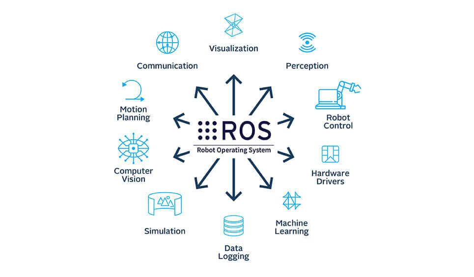
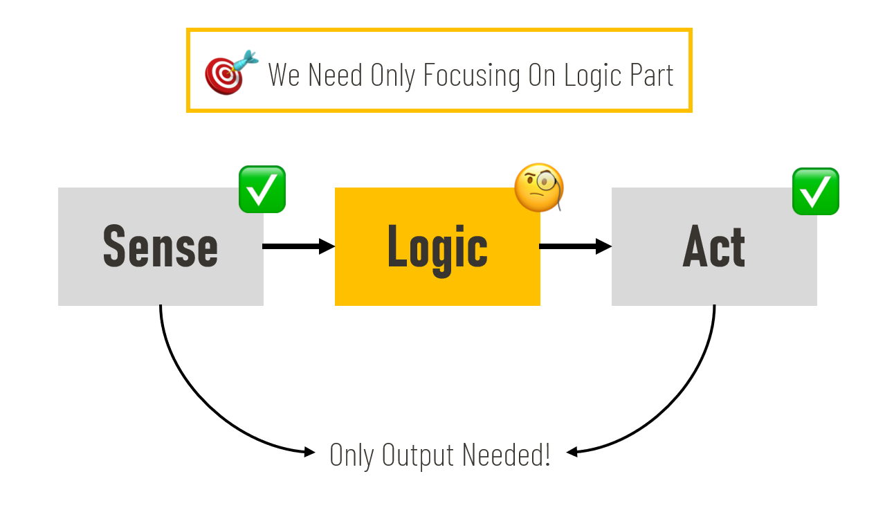
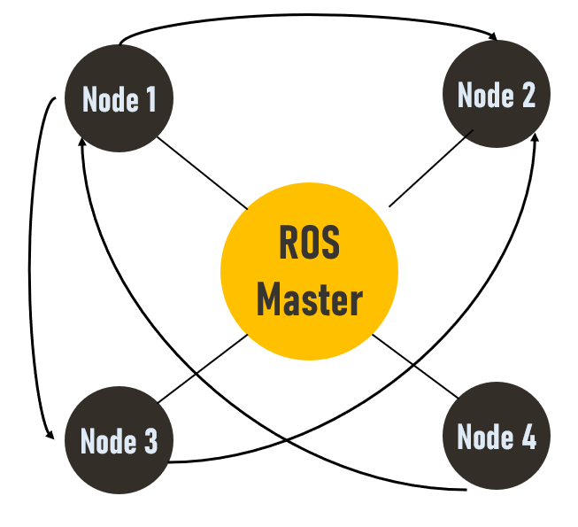
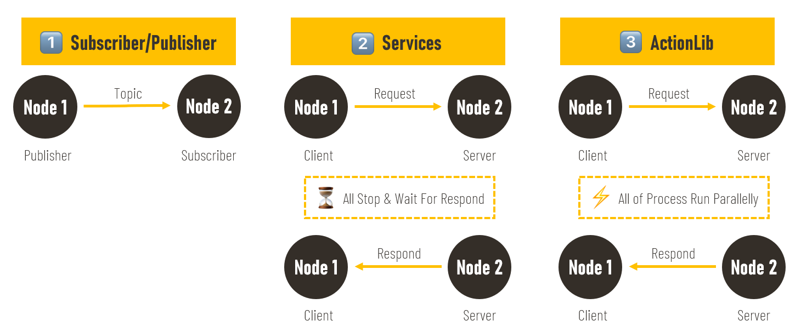

# دوره مقدماتی آموزش سیستم عامل ROS



سیستم عامل ربات ها (ROS)، بستری قدرتمند و سریع را برای یکپارچه سازی کدهای مربوط به هر یک از واحدهای ربات فراهم می سازد. به کمک سیستم عامل ربات ها می توانید تحت لینوکس کد مربوط به هر یک از واحدهای فوق را در یک گره (Node) بنویسید و ارتباط موثر بین این گره ها را از طریق پیام هایی (Topic) ایجاد کنید. سیستم عامل ربات ها یا همان ROS علاوه بر ایجاد یک ساختار منظم و کاربردی برای توسعه ربات ها، پکیج هایی استاندارد برای کاربردهای بینایی، کنترل و درایو، طراحی مسیر، نمایش داده ها و ... فراهم می کند. در این آموزش ما قصد داریم تا با این سیتسم عامل رباتیک آشنا شویم. مباحث این آموزش:

- آشنایی با مقدمات و چارچوب کلی سیستم عامل ربات
- آشنایی با دستورات مهم لینوکس
- آشنایی با سیستم عامل ROS، نصب، ایجاد محیط کاری
- آشنایی با نحوه ایجاد گره ها و تاپیک ها
- آشنا با سرویس ها
- آشنایی با پارامترها
- امکانات کاربردی سیستم عامل ROS
- آشنایی با فایل launch
- آشنایی با TFها
- زمان در ROS
- اجرای تحت شبکه ROS
- ارتباط Action در سیستم عامل ROS
- آشنایی با تنظیمات دینامیک
- آشنایی با محیط rviz و اجرای چند مثال کاربردی

در ادامه به برسی هر کدام از عناوین مطرح شده می پردازیم. لازم به ذکر است که در آینده آموزش ویدیویی ضبط و لینک آن به این صفحه اضافه خواهد شد. توجه شود که این آموزش در برگیرنده مطالب در مورد نسخه اول سیستم عامل رباتیک (ROS) می باشد.

## آشنایی با مقدمات و چارچوب سیستم عامل ربات

همان گونه که ذکر شد سیستم عامل ربات (ROS) یک چارچوب (Framework) برای توسعه استاندارد و سریع برنامه های رباتیکی می باشد که از مزایای اصلی این چارچوب می توان به متن باز (Open-Sourse) و حاوی پکیج و ابزارهای کاربردی بودن اشاره کرده. این پکیج در سال 2009 توسط یک استارت آپ به نام Willow Garage و توسط دو فرد به نام های Eric Berger و Keenan Wyrobek توسعه یافته است و از حدود سال 2014 به صورت متن باز منتشر شده است. لیست ورژن های مختلف این سیستم عامل را می توانید در لینک زیر مشاهده نمایید:

https://wiki.ros.org/Distributions

یکی از دلایل استفاده از سیستم عامل ربات (ROS) این است که در اکثر پروژه های رباتیک ما با چالش هایی برای درایور کردن عملگرها (Actuators) و حسگرها (Sensors) و اجرای این بخش اگر قرار باشد از صفر صورت بپذیرد، علاوه بر وقت گیر بودن، ما را باگ ها و مشکلات فراوان در مراحل بعدی روبرو می کند.سیستم عامل ربات شرایطی را برای ما فراهم می کنید تا ما صرفاً بر روی بخش منطق ربات کار کنیم و برای دو بخش حسگرها و عملگرها از پکیج های استاندارد ROS بهره ببریم. از مزایای دیگر سیستم عامل ربات می توان به سازگار بودن با زبان های مختلف (بالاخص زبان C++ , پایتون)، مناسب برای رشته های و حوزه های مختلف، بروزرسانی دائمی و جامعه کاربری بزرگ اشاره کرد. همچنین پکیج هایی که توسط ما بر چارچوب ROS ایجاد می شوند، قابلیت استفاده مجدد در کنار سایر پروژه ها (ما یا دیگران) را دارند.



سیستم عامل ربات (ROS) به ما این امکان را می دهد تا یک برنامه رباتیکی را به بخش های مختلف تقسیم کنیم که هر کدام از این بخش ها یک گره (Node) می باشد. این نودها می توانند به روش های مختلف با یک دیگر مرتبط باشند:

- تاپیک ها (Topics)
- سرویس ها (Services)
- اکشن ها (Actions)



در نوع ارتباطی تاپیک، یک نود وظیفه انتشار اطلاعات را دارد که به آن Publisher می گویند و به سایر گره ها که اطلاعات را دریافت می کند، Subscriber می گویند. توجه شود که این ارتباطات مداوم است. یعنی پس اتصال این دو گره به هم اطلاعات با فرکانس خاصی به صورت مداوم رد و بدل می شود. نوع بعدی ارتباط سرویس ها می باشد. در این روش ارتباطی یک گره سرور و یک گره کلاینت داریم. در ابتدا هرگاه کلاینک به اطلاعات نیاز داشته باشد به سرور یک درخواست (Request) و سرور نیز در جواب پس از انجام پردازش هایی، اطلاعات را پاسخ (Respond) می دهد. در این روش ارتباطی در بازه زمانی که درخواست ارسال شده تا لحظه دریافت پاسخ، برنامه کلاینت متوقف باقی می ماند. روش سرویس زمانی که پردازش های سرور طولانی باشد یا ما بخواهیم در حین این زمان پردازشی انجام دهیم فاقد کاربرد می شود؛ پس برای این حالت به سراغ روش سوم می رویم که اکشن نام دارد و مشابه سرویس ها است با این تفاوت که در بین زمان ارسال درخواست و دریافت پاسخ، برنامه متوقف نمی شود.



این روش های ارتباطی در بخش های بعدی برسی بیشتر خواهد شد. لازم به ذکر است که برای توسعه هر نود می توان از زبان های مختلف استفاده کرد، البته API ارایه شده برای پایتون و سی پلاس پلاس استاندارد تر است.

## آشنایی با دستورات ابتدایی لینوکس

در این بخش قصد داریم تا برخی از دستورات (command) معروف سیستم عامل لینوکس را با هم مرور کنیم. این دستورات در محیط ترمنیال (Terminal) لینوکس استفاده می شود و تا حدود زیادی کار ما را در محیط لینوکس راحت می کند. در بخش زیر می توانید لیست این کامند ها را با توضیحات مربوطه مرور نمایید:

```bash
# Sending ping packets to a ip or address
$ ping [ip/address] -c [number-of-packets]

# Open Manual of a linux command
$ man [command-name]

# List the recent directory files and dirs
$ ls

# Navigate to a dir
$ cd [directory-name]

# Show the active directory address from root
$ pwd

# Create a directory
$ mkdir [dir-name]

# Create a file
$ touch [file-name]

# Open a file with editor
$ nano/gedit/code [file-name]

# Remove a file
$ rm [file-name]

# Remove a dir
$ rm -r [dir-name]
#or
$ rmdir [dir-name]

# Dir tree
$ tree # install: sudo apt-get install tree

# Copy files
$ cp [file-name] [goal-dir] [new-name]

# Move files
$ mv [file-name] [goal-dir] [new-name]

# Add Executability to a file
$ chmod +x [file-name]

# Shut down
$ poweroff

# Restart
$ reboot
```

توجه شود که در ترمینال منظور از ~ شاخه Home و منظور از / شاخه root می باشد.
