# دوره مقدماتی آموزش سیستم عامل ROS


سیستم عامل ربات ها (ROS)، بستری قدرتمند و سریع را برای یکپارچه سازی کدهای مربوط به هر یک از واحدهای ربات فراهم می سازد. به کمک سیستم عامل ربات ها می توانید تحت لینوکس کد مربوط به هر یک از واحدهای فوق را در یک گره (Node) بنویسید و ارتباط موثر بین این گره ها را از طریق پیام هایی (Topic) ایجاد کنید. سیستم عامل ربات ها یا همان ROS علاوه بر ایجاد یک ساختار منظم و کاربردی برای توسعه ربات ها، پکیج هایی استاندارد برای کاربردهای بینایی، کنترل و درایو، طراحی مسیر، نمایش داده ها و ... فراهم می کند. در این آموزش ما قصد داریم تا با این سیتسم عامل رباتیک آشنا شویم. مباحث این آموزش:

- [آشنایی با مقدمات و چارچوب کلی سیستم عامل ربات](#آشنایی-با-مقدمات-و-چارچوب-سیستم-عامل-ربات)
- [آشنایی با دستورات مهم لینوکس](#آشنایی-با-دستورات-ابتدایی-لینوکس)
- [آموزش نصب ROS، ایجاد محیط کاری و ایجاد اولین پکیج](#آشنایی-با-نحوه-نصب-ros-ایجاد-محیط-کاری-و-اولین-پکیج)
- [آشنایی با نحوه ایجاد گره ها و تاپیک ها](#آشنایی-با-نحوه-ایجاد-گره-ها-و-تاپیک-ها)
- [آشنا با پیام ها و سرویس ها](#آشنا-با-پیام-ها-و-سرویس-ها)
- [آشنایی با پارامترها](#آشنایی-با-پارامترها)
- [آشنایی با rosbag](#آشنایی-با-rosbag)
- [آشنایی با roswtf](#آشنایی-با-roswtf)
- [آشنایی با ابزارهای rqt](#آشنایی-با-ابزارهای-rqt)
- [واحد های استاندارد](#واحد-های-استاندارد)
- [آشنایی با فایل های launch](#آشنایی-با-فایل-های-launch)
- [آشنایی با TFها](#آشنایی-با-tfها)
- [زمان در ROS](#زمان-در-ros)
- [اجرای تحت شبکه ROS](#اجرای-تحت-شبکه-ros)
- [ارتباط Action در محیط ROS](#ارتباط-action-در-محیط-ros)
- [تنظیم مجدد پارامترها با کمک Dynamic Reconfigure](#تنظیم-مجدد-پارامترها-با-کمک-dynamic-reconfigure)
- [آشنایی با محیط rviz و اجرای چند مثال](#آشنایی-با-محیط-rviz-و-اجرای-چند-مثال)

در ادامه به برسی هر کدام از عناوین مطرح شده می پردازیم. لازم به ذکر است که در آینده آموزش ویدیویی ضبط و لینک آن به این صفحه اضافه خواهد شد. توجه شود که این آموزش در برگیرنده مطالب در مورد نسخه اول سیستم عامل رباتیک (ROS) می باشد.

## آشنایی با مقدمات و چارچوب سیستم عامل ربات

همان گونه که ذکر شد سیستم عامل ربات (ROS) یک چارچوب (Framework) برای توسعه استاندارد و سریع برنامه های رباتیکی می باشد که از مزایای اصلی این چارچوب می توان به متن باز (Open-Sourse) و حاوی پکیج و ابزارهای کاربردی بودن اشاره کرده. این پکیج در سال 2009 توسط یک استارت آپ به نام Willow Garage و توسط دو فرد به نام های Eric Berger و Keenan Wyrobek توسعه یافته است و از حدود سال 2014 به صورت متن باز منتشر شده است. لیست ورژن های مختلف این سیستم عامل را می توانید در لینک زیر مشاهده نمایید:

https://wiki.ros.org/Distributions

یکی از دلایل استفاده از سیستم عامل ربات (ROS) این است که در اکثر پروژه های رباتیک ما با چالش هایی برای درایور کردن عملگرها (Actuators) و حسگرها (Sensors) و اجرای این بخش اگر قرار باشد از صفر صورت بپذیرد، علاوه بر وقت گیر بودن، ما را باگ ها و مشکلات فراوان در مراحل بعدی روبرو می کند.سیستم عامل ربات شرایطی را برای ما فراهم می کنید تا ما صرفاً بر روی بخش منطق ربات کار کنیم و برای دو بخش حسگرها و عملگرها از پکیج های استاندارد ROS بهره ببریم. از مزایای دیگر سیستم عامل ربات می توان به سازگار بودن با زبان های مختلف (بالاخص زبان C++ , پایتون)، مناسب برای رشته های و حوزه های مختلف، بروزرسانی دائمی و جامعه کاربری بزرگ اشاره کرد. همچنین پکیج هایی که توسط ما بر چارچوب ROS ایجاد می شوند، قابلیت استفاده مجدد در کنار سایر پروژه ها (ما یا دیگران) را دارند.


سیستم عامل ربات (ROS) به ما این امکان را می دهد تا یک برنامه رباتیکی را به بخش های مختلف تقسیم کنیم که هر کدام از این بخش ها یک گره (Node) می باشد. این نودها می توانند به روش های مختلف با یک دیگر مرتبط باشند:

- تاپیک ها (Topics)
- سرویس ها (Services)
- اکشن ها (Actions)


در نوع ارتباطی تاپیک، یک نود وظیفه انتشار اطلاعات را دارد که به آن Publisher می گویند و به سایر گره ها که اطلاعات را دریافت می کند، Subscriber می گویند. توجه شود که این ارتباطات مداوم است. یعنی پس اتصال این دو گره به هم اطلاعات با فرکانس خاصی به صورت مداوم رد و بدل می شود. نوع بعدی ارتباط سرویس ها می باشد. در این روش ارتباطی یک گره سرور و یک گره کلاینت داریم. در ابتدا هرگاه کلاینک به اطلاعات نیاز داشته باشد به سرور یک درخواست (Request) و سرور نیز در جواب پس از انجام پردازش هایی، اطلاعات را پاسخ (Respond) می دهد. در این روش ارتباطی در بازه زمانی که درخواست ارسال شده تا لحظه دریافت پاسخ، برنامه کلاینت متوقف باقی می ماند. روش سرویس زمانی که پردازش های سرور طولانی باشد یا ما بخواهیم در حین این زمان پردازشی انجام دهیم فاقد کاربرد می شود؛ پس برای این حالت به سراغ روش سوم می رویم که اکشن نام دارد و مشابه سرویس ها است با این تفاوت که در بین زمان ارسال درخواست و دریافت پاسخ، برنامه متوقف نمی شود.


این روش های ارتباطی در بخش های بعدی برسی بیشتر خواهد شد. لازم به ذکر است که برای توسعه هر نود می توان از زبان های مختلف استفاده کرد، البته API ارایه شده برای پایتون و سی پلاس پلاس استاندارد تر است.

## آشنایی با دستورات ابتدایی لینوکس

در این بخش قصد داریم تا برخی از دستورات (command) معروف سیستم عامل لینوکس را با هم مرور کنیم. این دستورات در محیط ترمنیال (Terminal) لینوکس استفاده می شود و تا حدود زیادی کار ما را در محیط لینوکس راحت می کند. در بخش زیر می توانید لیست این کامند ها را با توضیحات مربوطه مرور نمایید:

```bash
# Sending ping packets to a ip or address
$ ping [ip/address] -c [number-of-packets]

# Open Manual of a linux command
$ man [command-name]

# List the recent directory files and dirs
$ ls

# Navigate to a dir
$ cd [directory-name]

# Show the active directory address from root
$ pwd

# Create a directory
$ mkdir [dir-name]

# Create a file
$ touch [file-name]

# Open a file with editor
$ nano/gedit/code [file-name]

# Remove a file
$ rm [file-name]

# Remove a dir
$ rm -r [dir-name]
#or
$ rmdir [dir-name]

# Dir tree
$ tree # install: sudo apt-get install tree

# Copy files
$ cp [file-name] [goal-dir] [new-name]

# Move files
$ mv [file-name] [goal-dir] [new-name]

# Add Executability to a file
$ chmod +x [file-name]

# Shut down
$ poweroff

# Restart
$ reboot
```

توجه شود که در ترمینال منظور از ~ شاخه Home و منظور از / شاخه root می باشد.

## آشنایی با نحوه نصب ROS، ایجاد محیط کاری و اولین پکیج

در این بخش قصد داریم تا به نحوه نصب سیستم عامل ربات بپردازیم، سپس به نحوه ایجاد یک فضای کاری استاندارد برویم و اولین پکیج خودمان را نیز ایجاد نماییم. برای نصب ورژن Neotic سیستم عامل ROS می توانید به لینک زیر مراجعه نمایید:

http://wiki.ros.org/ROS/Installation

دستورات نصب به صورت خلاصه با کامنت در بخش زیر آورده شده است.

```bash
# Add the ros rep to apt dir
$ sudo sh -c 'echo "deb http://packages.ros.org/ros/ubuntu $(lsb_release -sc) main" > /etc/apt/sources.list.d/ros-latest.list'

# Install curl
$ sudo apt install curl # if you haven't already installed curl

# load curl asc file and pass key
$ curl -s https://raw.githubusercontent.com/ros/rosdistro/master/ros.asc | sudo apt-key add -

# Update the apt rep
$ sudo apt update

# Install ROS neotic
$ sudo apt install ros-noetic-desktop-full

# Add ros to Enviromental vars
$ echo "source /opt/ros/noetic/setup.bash" >> ~/.bashrc

# Source the bashrc file
$ source ~/.bashrc

```

پس از نصب ROS برای چک کردن اینکه آیا موفق می توانید کامند زیر هسته ROS را اجرا می نماید تست کنید:

```bash
$ roscore
```

همچنین با کامند زیر می توانید به محل نصب پکیج های ROS بروید:

```bash
$ cd /opt/ros/noetic/share/
```

پکیج های موجود در دایرکتوری بالا در واقع لیست پکیج هایی هستند که به صورت پیشفرض بر روی ROS فول ورژن موجود هستند. اگر پکیجی را در این دایرکتوری قرار دهید، می توانید از آن به صورت گلوبال بدون نیاز به اضافه کردن مجدد بهره ببرید. در کل با کمک دستور زیر می توانید، لیست محل هایی که پکیج های راس ذخیره می شوند را مشاهده نمایید:

```bash
$ echo $ROS_PACKAGE_PATH
```

همچنین ROS کامندهای برای مشاهده پکیج ها و اطلاعات آنها دارد. برخی از این کامندها (در ادامه نیز در بسته به نیاز بخش مربوطه کامنت هایی ارایه خواهند شد):

- برای مشاهده محل نصب یک پکیج (برای مثال پکیج roscpp) می توانید از دستور زیر کمک بگیرید:

```bash
$ rospack find roscpp
```

- همچنین برای رفتن به محل نصب آن، می توانید از دستور زیر بهره بگیرد:

```bash
$ roscd roscpp
```

- همچنین برای مشاهده محتویات یک پکیج می توانید از دستور زیر بهره ببرید:

```bash
$ rosls roscpp
```

همچنین با قرار دادن help جلوی سه کامند ذکر شده می توانید، با عملکرد بیشتر این پکیج ها آشنا شوید.
(از سوئیچر -h نیز می توان استفاده کرد.)

اکنون که ROS را با موفقیت نصب کردیم به سراغ ایجاد یک فضای کاری می رویم. فضای کار مجازی یا Virtual environment یک محیط استاندارد است که فایل کدهای خود را در داخل آن قرار می دهیم. برای ایجاد این محیط ابتدا یک پوشه به نام catkin_ws ایجاد کرده و همچنین در داخل آن یک دایرکتوری خالی به نام src ایجاد می کنیم. سپس کامند زیر را اجرا می کنیم تا کامپایلر ROS این محیط را برای ایجاد کند.

```bash
$ catkin_make
```

محیط کاری ما با موفقیت ایجاد شده. لازم به ذکر است در مراحل بعدی هرگاه نیاز شد مجدد برنامه را کامپایل کنیم، حتما به شاخه اصلی catkin_ws آمده و کامند بالا را اجرا کنید.

اکنون که محیط کاری مجازی را آماده کردیم، می توانیم به سراغ ایجاد اولین پکیج خود برویم. برای ایجاد پکیج کافی است به داخل پوشه src محیط کاری کتکین خود برویم و با کمک فرمت دستوری زیر یک پکیج ایجاد کنیم:

```bash
$ cd ~/catkin_ws/src
$ catkin_create_pkg <package_name> [depend1] [depend2] [depend3]
```

برای مثال:

```bash
$ catkin_create_pkg beginner_tuts std_msgs rospy roscpp
```

بعد مجدد به پوشه catkin_ws مراجعه شود و مجدد با دستور catkin_make کامپایل انجام شود. و همچنین دستور را در فایل bashrc قرار دهیم. (توجه شود که اگر در دایرکتوری هوم، ورک اسپیس را ایجاد نکرده اید آدرس زیر را اصلاح کنید!)

```bash
$ source ~/catkin_ws/devel/setup.bash
```

همچنین برای مشاهده پیش نیازها و dependencies های یک پکیج می توانید از دستور زیر کمک بگیرید (دستور زیر فقط پیش نیازهای مرحله اول را نمایش می دهد):

```bash
$ rospack denpend1 [package-name]
```

در صورتیکه بخواهید تمام پیش نیاز ها را ببینید از دستور زیر بهره بگیرید:

```bash
$ rospack denpend [package-name]
```

نکته: در فایل package.xml اطلاعات پکیج، ورژن، پیشنیاز ها و سایر اطلاعات نمایش داده می شود.

نکته: در فایل CMakeLists.txt مربوط به تنظمیات کامپایلر می باشد که لیست پکیج های پیشنیاز، پیام ها، سرویس ها، اکشن ها، اطلاعات کامپایل و ... قرار گرفته است و معمولا اگر قرار باشد یک نود با سی پلاس پلاس نوشته شود، با این فایل بسیار کار می شود.

برای دریافت اطلاعات بیشتر به صفحه خود داکیومنت راس به آدرس زیر مراجعه شود:

http://wiki.ros.org/ROS/Tutorials/CreatingPackage

## آشنایی با نحوه ایجاد گره ها و تاپیک ها

در این قسمت قصد داریم تا در مورد نحوه ایجاد گره ها (Nodes) و نحوه ایجاد تاپیک (Topics) توضیحاتی را ارایه کنیم. در ابتدا قبل ایجاد یک گره و تاپیک، چند گره معروف در ROS را اجرا میکنم. در این سیستم عامل یک پکیج با نام turtlesim وجود دارد که برای تست کردن دستورات ROS مورد استفاده قرار می گیرد. برای اجرای هر برنامه ROS نیاز است تا ابتدای کار هسته آن اجرا شود. هسته همانگونه که زودتر بیان شد با کامند زیر اجرا می شود:

```bash
$ roscore
```

برای اجرای نودها نیز از کامند زیر بهره می بریم:

```bash
$ rosrun [package-name] [node-name]
```

برای مثال برنامه لاکپشت را اجرا می کنیم، این برنامه به دو نود turtlesim_node و turtle_teleop_key را اجرا نماییم:

```bash
$ roscore
$ rosrun turtlesim turtlesim_node
$ rosrun turtlesim turtle_teleop_key
```

خروجی این برنامه به شکل زیر خواهد بود. با تغییر دکمه های موس در ترمینال مربوط به turtle_teleop_key لاکپشت شروع به حرکت می کند.

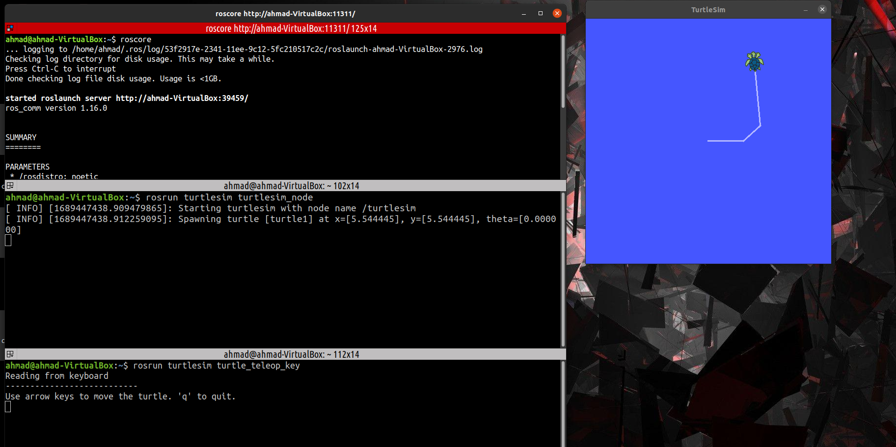

در ادامه به برسی برخی از دستورات کاربردی در مورد گره ها و تاپیک ها می پردازیم. شما می توانید با تکرار این دستورها با برنامه turtle این دستورات را تمرین نمایید:

برای مشاهده اطلاعات یک نود از دستور زیر استفاده کنید:

```bash
$ rosnode info /rosout
```

ّبرای اجرای یک نود از یک پکیج از دستور زیر استفاده نمایید:

```bash
$ rosrun [package-name] [node-name]
```

ّتوجه شود که نودهای داخل راس تحت شبکه اجرا می شود، برای پینگ گرفتن از یک نود از دستور زیر می توان بهره برد:

```bash
$ rosnode ping /rosout
```

برای مشاهده گراف نودها می توانید از دستور زیر بهره ببرید:

```bash
$ rosrun rqt_graph rqt_graph
```

یا دستور زیر را به صورت خلاصه وارد کنید (از نئوتیک ب بعد):

```bash
$ rqt_graph
```

برای مشاهده اطلاعات یک تاپیک می توانید از دستور rostopic بهره ببرید، برای اطلاع کامل از این دستور کامند زیر را وارد نمایید تا help آنرا مشاهده نمایید:

```bash
$ rostopic -h
```

برای مثال با کمک دستور زیر می توانید لیست تاپیک ها را ببیند:

```bash
$ rostopic list
```

نکته: برای مشاهده لیست تاپیک ها به صورت دسته بندی شده، از دستور زیر بهره می بریم:

```bash
$ rostopic list -v
```

با کمک دستور زیر می توانید پیام های رد و بدل شده در یک تاپیک را مشاهده کنید:

```bash
$ rostopic echo /topic-name
```

با کمک دستور زیر می توانید نوع تاپیک را مشاهده نمایید:

```bash
$ rostopic type /topic-name
```

برای پابلیش کردن دیتا در یک تاپیک می توانید از دستور rostopic pub این کار را انجام دهید، البته قبل از آن نیاز است تا ساختار تاپیک را بدانیم، با کمک دستور زیر می توانید ساختار تاپیک (نوع message) را مشاهده کنید:

```bash
$ rosmsg show [message-name]
```

و سپس با دستور زیر داخل تاپیک پیام دلخواه خود را منتشر کنید:

```bash
$ rostopic pub [topic-name] [message-type] data
```

توجه شود اگر نتوانستید نوع مسیج را تایپ کنید از کلید TAB استفاده نمایید، همچنین اگر نتوانستید ساختار دیتا را وارد نمایید، دوباره TAB را بزنید. (ویدیو را ببنید متوجه می شوید)

برای متناوب کردن دستور پاب می توانیم از سوئیچر -r بهره ببریم:

```bash
$ rostopic pub [topic-name] [message-type] data -r 3
```

برای مثال در کامند بالا گفتیم با فرکانس 3 هرتز حرکت ذکر شده را تکرار کن!

با کمک دستور زیر می توانیم فرکانس پابلیش یک پیام در یک تاپیک را مشاهده کنیم

```bash
$ rostopic hz [topic-name]
```

برای پلات کردن یک تاپیک می توانید از پنجره rqt_plot بهره ببرید:

```bash
$ rosrun rqt_plot rqt_plot
```

در ادامه به نحوه ایجاد دو عدد گره برای تبادل پیام در بستر یک تاپیک می پردازیم. ابتدا این نودها را با کمک سی پلاس پلاس ایجاد می کنیم و سپس به سراغ پایتون می رویم. برای ایجاد یک تاپیک کافی است به پکیج خود و در پوشه src بروید و یک فایل ایجاد کنید، برای مثال می خواهیم دو نود ایجاد کنیم، یک نود فرستنده و یک نود دریافت کنند که با یک تاپیک با هم در ارتباط هستند. در ابتدا با کمک کامند زیر به پوشه پکیج خود بروید:

```bash
$ roscd beginner_tutorials
```

سپس به پوشه src بروید و با کمک کامند زیر نود مربوط به فرستنده (talker) ایجاد نمایید. در ابتدا در سی پلاس پلاس را توضیح می دهیم سپس به سراغ نوع پایتونی می رویم:

```bash
$ cd src
$ touch talker.cpp
```

اکنون در داخل فایل ایجاد شده کد زیر را قرار می دهیم (در کامنت های کد زیر، توضیحات خلاصه و البته کافی داده شده است):

```c++
// Adding ROS Libs to our cpp code
#include "ros/ros.h"
#include "std_msgs/String.h"
#include <sstream>

// cpp main loop
int main(int argc, char \*\*argv)
{
// create a node with the name of "talker"
ros::init(argc, argv, "talker");

// creat a class for calling node (n)
ros::NodeHandle n;

// create a publisher-topic with the name of chatter (the topic name is chatter)
ros::Publisher chatter_pub = n.advertise<std_msgs::String>("chatter", 1000); // 1000 msg available
ros::Rate loop_rate(10); // 100ms delay

int count = 0;
while (ros::ok()) // when roscore is ok!
{

    // create msg and add it to class
    std_msgs::String msg;
    std::stringstream ss;

    // print hello world as msg
    ss << "hello world " << count;

    // log the msg in terminal
    msg.data = ss.str();
    ROS_INFO("%s", msg.data.c_str());

    // publishing the created msg
    chatter_pub.publish(msg);

    // re-match with roscore
    ros::spinOnce();
    loop_rate.sleep(); // 100ms delay
    ++count;

}

return 0;
}
```

برای مشاهده این مثال در داکیومت راس به لینک زیر مراجعه نمایید:

http://wiki.ros.org/ROS/Tutorials/WritingPublisherSubscriber%28c%2B%2B%29

حال که برنامه فرستنده یا همان پابلیشر (talker.cpp) ایجاد شد به سراغ ایجاد برنامه دریافت کنند یا همان سابسکرایبر (listener.cpp) می رویم. با کمک کامند زیر آنرا ایجاد کنید:

```bash
$ touch listener.cpp
```

و سپس درون آن کدهای زیر را قرار دهید:

```c++
// libs
#include "ros/ros.h"
#include "std_msgs/String.h"

// call-back function for receive data
void chatterCallback(const std_msgs::String::ConstPtr& msg) // Input: String
{
  ROS_INFO("I heard: [%s]", msg->data.c_str()); // log received data in terminal
}


int main(int argc, char **argv)
{

  // create a node with the name of "listener"
  ros::init(argc, argv, "listener");
  ros::NodeHandle n;

  // create a subscriber-topic with the name of chatter (the topic name is chatter)
  ros::Subscriber sub = n.subscribe("chatter", 1000, chatterCallback); // listen to topic with name of chatter
  ros::spin(); // re-match with ros core

  return 0;
}
```

حال برای کامپایل کردن ابتدا باید تغییرات لازم را در فایل CMakeList ایجاد کنیم. باید دو فایل talker.cpp و listener.cpp را به عنوان دو فایلی که قرار است کامپایل شوند معرفی کنیم. دو کد زیر را در بخش build قرار دهید:

```c
add_executable(talker src/talker.cpp)
target_link_libraries(talker ${catkin_LIBRARIES})
add_dependencies(talker beginner_tutorials_generate_messages_cpp)

add_executable(listener src/listener.cpp)
target_link_libraries(listener ${catkin_LIBRARIES})
add_dependencies(listener beginner_tutorials_generate_messages_cpp)
```

البته تفاوتی نمی کند کجا فایل قرار گرفته باشد 😂

توجه کنید اگر از ورژن ملودیک و نئوتیک راس استفاده میکنید دو خط زیر را قرار دهید:

```c
add_executable(talker src/talker.cpp)
target_link_libraries(talker ${catkin_LIBRARIES})


add_executable(listener src/listener.cpp)
target_link_libraries(listener ${catkin_LIBRARIES})
```

حال به شاخه اصلی بروید و با catkin_make برنامه را کامپایل نمایید و با کمک دستور rosrun نود های نوشته شده را اجرا نمایید:

```bash
$ cd ..
$ catkin_make
$ roscore
$ rosrun beginner_tuts listener
$ rosrun beginner_tuts talker
```

اکنون اجرا شدن برنامه را مشاهده خواهید کرد، فراموش نکته هسته راس را روشن نمایید. همچنین اگر در کد سی پلاس پلاس تغییری کردید مجدد کامپلایل نمایید (با کنترل اس، تغییرات اعمال نمیشه 😂) برای مشاهده جزئیات بیشتر می توانید به لینک زیر در داکیومنت خود راس مراجعه نمایید:

http://wiki.ros.org/ROS/Tutorials/WritingPublisherSubscriber%28c%2B%2B%29

ایجاد همین پابلیشر سابسکرایبر در پایتون بسیار راحت تر می باشد، چراکه نیاز به کامپایل ندارد و برنامه های پایتون به صورت آنلاین (چون مفسریند) اجرا می شود. یک پوشه تحت عنوان scripts در دایرکتوری اصلی پکیج beginner_tuts ایجاد کنید و دو فایل پایتونی با نام های talker.py و listener.py ایجاد کنید:

```bash
$ roscd beginner_tuts
$ mkdir scripts
$ cd scripts
$ touch talker.py listener.py
```

اکنون کد زیر را در فایل talker.py قرار دهید:

```python
#!/usr/bin/env python
import rospy
from std_msgs.msg import String

def talker(): # create a node with name of talker
rospy.init_node('talker', anonymous=True)

    # create a topic (publisher) with name of chatter
    pub = rospy.Publisher('chatter', String, queue_size=10)
    rate = rospy.Rate(10) # 10hz or 100ms
    while not rospy.is_shutdown(): # until when roscore is ok
        hello_str = "hello world %s" % rospy.get_time() # make an string
        rospy.loginfo(hello_str) # log it in terminal
        pub.publish(hello_str) # publish it in chatter topic
        rate.sleep() # 100ms delay

if **name** == '**main**': # run it if we are in this file
try:
talker()
except rospy.ROSInterruptException: # any error then pass it
pass
```

و کد زیر را نیز در listener.py قرار دهید:

```python
#!/usr/bin/env python
import rospy
from std_msgs.msg import String

# call-back function

def callback(data):
rospy.loginfo(rospy.get_caller_id() + 'I heard %s', data.data)

def listener(): # create a node with name of listener
rospy.init_node('listener', anonymous=True)

    # create a topic (subscriber) with name of chatter
    rospy.Subscriber('chatter', String, callback)

    rospy.spin() # re-match with roscore

if **name** == '**main**':
listener()
```

برای اجرای کدهای پایتون باید دسترسی آنها را با کمک کامند chmod تغییر بدهیم، کافیست در پوشه script یک دور کامند زیر را اجرا نماییم (همه برنامه ها قابل اجرا می شوند):

```bash
$ roscd beginner_tuts
$ cd scripts
$ chmod +x *
```

حال با کمک کامندهای زیر می توانید این مثال را اجرا نمایید:

```bash
$ roscore
$ rosrun beginner_tuts talker.py
$ rosrun beginner_tuts listener.py
```

توجه شود که اگر با خطا روبرو شدید کامندهای زیر را نیز امتحان کنید (روی برخی از لینوکس ها با python و روی برخی دگر با python3)

```bash
$ roscore
$ python3 talker.py
$ python3 listner.py
```

توجه شود که اگر از در داخل ROS ملودیک هستید در برنامه های پایتونی خود از کامنت هدر زیر استفاده کنید:

```python
#!/usr/bin/env python
```

و اگر در داخل نئوتیک هستید از کد زیر استفاده کنید:

```python
#!/usr/bin/env python3
```

با این کامنت ورژن پایتون سند پایتونی را به مفسر پایتون می فهمانید.

## آشنا با پیام ها و سرویس ها

در برخی از مواقع نیاز می شود تا فرمت خاصی برای ارتباط از نوع تاپیک تعریف کنیم. در این مواقع از پیام ها (Message) استفاده می کنیم. ساختار یک پیام را می توان با کمک دیتا-تایپ های زیر تعریف کرد:

```
int8 (also uint8)
int16
int32
int64
float32
string
time
duration
(other types of msg)
(using arrays [])
header
```

برای ایجاد یک مسیج اختصاصی (برای مثال مسیج Student) در ابتدا نیاز است تا ابتدا در داخل پوشه پکیج مان یک پوشه به نام msg ایجاد کنیم و سپس در داخل این پوشه، یک فایل با نام مسیج مورد نظر (مثلا Student.msg) ایجاد نماییم:

```bash
$ roscd beginner_tuts
$ mkdir msg && cd msg
$ touch Student.msg
```

سپس در فایل Student.msg ساختار پیام خود را با کمک دیتاتایپ هایی که مشخص شد تعریف کنیم (برای مثال نام و نام خانوادگی را با رشته، سن را عدد اینتجر و نمرده را با float32 مشخص می کنیم):

```
string name
string lastname
int8 age
float32 score
```

حال که مسیج را تعریف کردیم نیاز است تا آنرا به راس و کامپایلر بشناسانیم. درون پوشه پکیج در داخل فایل package.xml دو خط زیر را uncomment کنید:

```xml
<build_depend>message_generation</build_depend>
<exec_depend>message_runtime</exec_depend>
```

برای شناساندن این نوع پیام به کامپایلر نیاز است تا در فایل CMakeList.txt نیز تغییراتی اعمال کنیم. در ابتدا نیاز است تا پکیج message_generation را به لیست پکیج های پیش نیاز اضافه کنیم، یعنی در داخل تابع find_package قرار دهیم، که در واقع این تابع به صورت زیر در می آید:

```c++
find_package(catkin REQUIRED COMPONENTS
  roscpp
  rospy
  std_msgs
  message_generation
)
```

همچنین نیاز است تا خط زیر در داخل تابع catkin_package کامنتش غیرفعال و message_runtime به انتهای آن اضافه شود:

```c++
catkin_package(
  CATKIN_DEPENDS roscpp rospy std_msgs message_runtime
)
```

حال نیاز است تا آدرس فایل مسیج را به تابع add_message_file بدهیم (حتما Uncomment کنید و در همان محل قرار دهید):

```c++
 add_message_files(
   FILES
   Student.msg
 )
```

همچنین بخش generate_message را نیز به حالت uncomment در بیاورید:

```c++
 generate_messages(
   DEPENDENCIES
   std_msgs
 )
```

اکنون مجدد به شاخه اصلی پروژه بروید و یک دوره catkin_make را اجرا کنید. سپس اگر محیط کار را سورس نکردید، سورس کنید (اگر هم که کردید که هیچ) . اکنون با کمک دستور زیر می توانید مسیج ایجاد شده را مشاهده نمایید:

```bash
$ rosmsg show Student
```

برای مشاهده جزئیات بیشتر در مورد پیام ها (Messages) می توانید به لینک زیر در داخل خود ویکی راس مراجعت نمایید:

http://wiki.ros.org/ROS/Tutorials/CreatingMsgAndSrv

در ادامه به سراغ سرویس ها می رویم. سرویس یک نوع ارتباطی دو طرفه می باشد، شبیه توابع در برنامه نویسی است. برخی از کامندهایی که در کار با سروریس ها بکار می آیند را با هم مرور می کنیم. لیستی از این کامندها

```bash
$ rosservice -h
$ rosservice list
$ rosservice type /clear
$ rosservice info /clear
```

برای استفاده از یک سرویس در درون ترمینال از سوئیچر call استفاده می کنیم، برای مثال قصد داریم از سرویس /clear که مربوط به پکیج turtlesim است استفاده کنیم. در درون این سرویس یک تابع قرار گرفته که مسیری که لاکپشت رفته را پاک میکند (توجه کنید که این سرویس در ورودی چیزی نمی گیرد):

```bash
$ rosservice call /[service-name] [value]
$ rosservice call /clear
```

برای مشاهده نوع مسیج هایی که در سرویس ها رد بدل می شود از کامند زیر استفاده می کنیم:

```bash
$ rossrv show turtlesim/Spawn

```

توجه شود که مقدار turtlesim/Spawn در کامند بالا با کمک rosservice type استخراج شده است. با کمک کامند بالا ما ساختار این مسیج را می بینیم! برای راحتی می توانیم با کمک دستور پایپ (|) دو دستور را در یک کامند لاین اجرا کنیم. دستور پایپ خروجی دستور اول را در ورودی دستور دوم قرار می دهد:

```bash
$ rosservice type /spawn | rossrv show
```

در ادامه می خواهیم در پنچره یک لاکپشت دیگر با کمک سرویس spawn ایجاد کنیم. ساختار دستوری زیر را اجرا می کنیم:

```bash
$ rosservice call /[service-name] [datas]
$ rosservice call /spawn "x: -1.0 y: 1.0 theta: 2.0 name: 'myturtle'"
```

توجه کنید که با دوبار تب زدن می توانید ساختار دیتا را لود کنید! توجه کنید که سرویس spawn به ما به عنوان خروجی نام انتخابی را بازخواهد گرداند!

در ادامه به نحوه ایجاد یک سرویس در داخل پکیج مان می پردازیم. برای اینکار نیاز است تا ابتدا به دایرکتوری پروژه ما برویم و نیاز است در داخل پکیج مان پیام های مخصوص سرویس ها (که با فرمت .srv هستند) را ایجاد کنیم. بدین منظور ابتدا یک پوشه به نام srv که حاوی پیام های سرویسی ما هست را اجرا ایجاد می کنم و در داخل آن یک فایل با نام دلخواه و فرمت .srv (مثلا AddTwoInts.srv) را ایجاد میکنیم:

```bash
$ roscd beginner_tuts/
$ mkdir srv && cd srv
$ touch AddTwoInts.srv
```

در ادامه باید مسیج سرویسی را ایجاد کنیم (فرمت مشابه همان مسیج های عادی است با این تفاوت که در اینجا باید نوع خروجی را نیز مشخص کنیم، برای مشخص کردن خروجی از "---" استفاده میکنم:

```
int64 a
int64 b
---
int64 sum
```

همچنین از آنجایی که ما داریم از پکیج آموزشی خود را استفاده می کنیم می توانید مستقیمن این فایل را به پوشه srv کپی کنید. برای کپی کردن فایل های داخلی خود پکیج راس از دستور roscp استفاده میکنم:

```bash
$ roscd rospy_tutorials AddTwoInts.srv srv/AddTwoInts.srv
```

در ادامه برای فهماندن این نوع مسیج به کامپایلر از در داخل فایل CmakeLists.txt در بخش سرویس، تابع add_service_files را از حالت کامنت خارج و نام فایل srv مان را معرفی میکنم:

```python
## Generate services in the 'srv' folder
 add_service_files(
   FILES
   AddTwoInts.srv
 )
```

در ادامه با کمک دستور catkin_make یک دور از پکیج کامپایل می گیریم. اکنون ما سرویس را ایجاد کردیم (در واقع سرویس یک نوع مسیج است) و اکنون برای بهره گیری از این سرویس نیاز به یک سرور و کلاینت داریم. برای ایجاد سرور و کلاینت می توانیم از پاتیون یا سی پلاس پلاس بهره گیری کنیم. ابتدا ما با کمک سی پلاس پلاس این کار را انجام می دهیم.

برای ایجاد برنامه سی پلاس پلاس ما دو نود نیاز داریم یک نود که وظیفه سرور را برای ما انجام دهد و یک نود که برای ما وظیفه کلاینت را بر عهده بگیرد. ما دو فایل add_two_ints_client.cpp و add_two_ints_server.cpp را در داخل پوشه src ایجاد می کنیم. کد فایل add_two_ints_server.cpp به شرح زیر می باشد (کامنت ها گویای کد است):

```c++
#include "ros/ros.h"
#include "beginner_tuts/AddTwoInts.h"


// Service Servicer Function: add
bool add(beginner_tuts::AddTwoInts::Request  &req,
         beginner_tuts::AddTwoInts::Response &res)
{
  res.sum = req.a + req.b; // res = {sum}, req ={a,b}
  ROS_INFO("request: x=%ld, y=%ld", (long int)req.a, (long int)req.b);
  ROS_INFO("sending back response: [%ld]", (long int)res.sum);
  return true;
}


int main(int argc, char **argv)
{
  // Initiazte Node
  ros::init(argc, argv, "add_two_ints_server");
  ros::NodeHandle n;


  // Initiate Creating Service Server & And Publishing A "add" Service
  ros::ServiceServer service = n.advertiseService("add_two_ints", add);
  ROS_INFO("Ready to add two ints.");
  ros::spin();


  return 0;
}
```

و کد فایل add_two_ints_client.cpp حاوی کد زیر می باشد:

```c++
#include "ros/ros.h"
#include "beginner_tuts/AddTwoInts.h"
#include <cstdlib>


int main(int argc, char **argv)
{

  // Create A Node
  ros::init(argc, argv, "add_two_ints_client");
  if (argc != 3) // 3 Arguments in Terminal
  {
    ROS_INFO("usage: add_two_ints_client X Y");
    return 1;
  }


  // Create A Service Client
  ros::NodeHandle n;
  ros::ServiceClient client = n.serviceClient<beginner_tuts::AddTwoInts>("add_two_ints");

  // Create A Service
  beginner_tuts::AddTwoInts srv;


  // Getting Service a,b From Terminal Argument
  srv.request.a = atoll(argv[1]);
  srv.request.b = atoll(argv[2]);
  if (client.call(srv))
  {
    ROS_INFO("Sum: %ld", (long int)srv.response.sum);
  }
  else
  {
    ROS_ERROR("Failed to call service add_two_ints");
    return 1;
  }


  return 0;
}
```

پس از تنظیم کدها یک دور catkin_make را اجرا کنید تا فایل ها کامپایل شود. توجه کنید که حتما چهار خط زیر را در فایل CMakeList.txt قرار دهید تا این فایل ها به کامپایلر معرفی شوند:

```c++
add_executable(add_two_ints_server src/add_two_ints_server.cpp)
target_link_libraries(add_two_ints_server ${catkin_LIBRARIES})


add_executable(add_two_ints_client src/add_two_ints_client.cpp)
target_link_libraries(add_two_ints_client ${catkin_LIBRARIES})
```

در ادامه برای اجرای این کد، کامند های زیر را اجرا می کنیم:

```bash
$ roscore
$ rosrun beginner_tuts add_two_ints_serve
$ rosservice call /add_two_ints 1 2
$ rosrun beginner_tuts add_two_ints_client 2 3
```

در ادامه به نحوه ایجاد این برنامه در پایتون می پردازیم.

برای پایتون هم به صورت مشابه دو نود با نام های add_two_ints_client.py و add_two_ints_server.py ایجاد می کنیم. کد موجود در add_two_ints_server.py به شرح زیر است:

```python
#!/usr/bin/env python


from __future__ import print_function


from beginner_tuts.srv import AddTwoInts,AddTwoIntsResponse
import rospy


def handle_add_two_ints(req):
    print("Returning [%s + %s = %s]"%(req.a, req.b, (req.a + req.b)))
    return AddTwoIntsResponse(req.a + req.b)


def add_two_ints_server():
    rospy.init_node('add_two_ints_server')
    s = rospy.Service('add_two_ints', AddTwoInts, handle_add_two_ints)
    print("Ready to add two ints.")
    rospy.spin()


if __name__ == "__main__":
    add_two_ints_server()

```

کد موجود در add_two_ints_client.py به شرح زیر است:

```python
#!/usr/bin/env python

from **future** import print_function

import sys
import rospy
from beginner_tutorials.srv import \*

def add_two_ints_client(x, y):
rospy.wait_for_service('add_two_ints')
try:
add_two_ints = rospy.ServiceProxy('add_two_ints', AddTwoInts)
resp1 = add_two_ints(x, y)
return resp1.sum
except rospy.ServiceException as e:
print("Service call failed: %s"%e)

def usage():
return "%s [x y]"%sys.argv[0]

if **name** == "**main**":
if len(sys.argv) == 3:
x = int(sys.argv[1])
y = int(sys.argv[2])
else:
print(usage())
sys.exit(1)
print("Requesting %s+%s"%(x, y))
print("%s + %s = %s"%(x, y, add_two_ints_client(x, y)))
```

## آشنایی با پارامترها

در ادامه به روش ارتباطی پارامتری می پردازیم. پارامترها ثابت هایی هستند که در هسته راس ذخیره می شوند. با کمک دستور زیر می توانیم با پارامترها کار کنیم:

```bash
$ rosparam -h
$ rosparam set
$ rosparam get
$ rosparam delete
$ rosparam list
```

برای خواندن یا ذخیره کردن پارامترها داخل یک فایل از دو کامند زیر بهره می بریم:

```bash
$ rosparam load [file-address]
$ rosparam dump [file-address]
```

برای استفاده از پارامترها در برنامه سی پلاس پلاس به شیوه زیر عمل می کنیم:

```c++
ros::NodeHandle nh;
std::string global_name, relative_name, default_param;
if (nh.getParam("/global_name", global_name))
{
  ...
}

if (nh.getParam("relative_name", relative_name))
{
...
}

// Default value version
nh.param<std::string>("default_param", default_param, "default_value");
```

همچنین بدون ایجاد نود هم می توانید به طریق زیر عمل کنید:

```c++
std::string global_name, relative_name, default_param;
if (ros::param::get("/global_name", global_name))
{
  ...
}

if (ros::param::get("relative_name", relative_name))
{
...
}

// Default value version
ros::param::param<std::string>("default_param", default_param, "default_value");
```

برای ست کردن مقادیر بر روی پارامتر در سی پلاس پلاس به شیوه زیر عمل می کنیم:

```c++
ros::NodeHandle nh;
nh.setParam("/global_param", 5);
nh.setParam("relative_param", "my_string");
nh.setParam("bool_param", false);
```

همچنین بدون ایجاد نود می توانید پارامترها مقدار دهی کنید:

```c++
ros::param::set("/global_param", 5);
ros::param::set("relative_param", "my_string");
ros::param::set("bool_param", false);
```

برای مشاهده موجود بودن یک پارامتر می توانید به دو روش زیر عمل کنید:

```c++
ros::NodeHandle nh;
if (nh.hasParam("my_param"))
{
  ...
}
```

یا

```c++
if (ros::param::has("my_param"))
{
  ...
}
```

همچنین برای پاک کردن یک پارامتر در سی پلاس پلاس می توانید به روش زیر عمل کنید:

```c++
ros::NodeHandle nh;
nh.deleteParam("my_param");
```

یا

```c++
ros::param::del("my_param");
```

در زبان پایتون نیز مشابه و ساده تر می باشد:

دریافت اطلاعات یک پارامتر:

```python
global_name = rospy.get_param("/global_name")
relative_name = rospy.get_param("relative_name")
private_param = rospy.get_param('~private_name')
default_param = rospy.get_param('default_param', 'default_value')

# fetch a group (dictionary) of parameters
gains = rospy.get_param('gains')
p, i, d = gains['p'], gains['i'], gains['d']
```

مقداردهی پارامترها:

```python
# Using rospy and raw python objects
rospy.set_param('a_string', 'baz')
rospy.set_param('~private_int', 2)
rospy.set_param('list_of_floats', [1., 2., 3., 4.])
rospy.set_param('bool_True', True)
rospy.set_param('gains', {'p': 1, 'i': 2, 'd': 3})

# Using rosparam and yaml strings
rosparam.set_param('a_string', 'baz')
rosparam.set_param('~private_int', '2')
rosparam.set_param('list_of_floats', "[1., 2., 3., 4.]")
rosparam.set_param('bool_True', "true")
rosparam.set_param('gains', "{'p': 1, 'i': 2, 'd': 3}")

rospy.get_param('gains/p') #should return 1
```

مشاهده موجود بودن یک پارامتر و حذف آن:

```python
if rospy.has_param('to_delete'):
    rospy.delete_param('to_delete')
```

برای مشاهده جزئیات بیشتر به لینک های زیر مراجعه نمایید:

پایتون: http://wiki.ros.org/rospy/Overview/Parameter%20Server

سی پلاس پلاس: http://wiki.ros.org/roscpp/Overview/Parameter%20Server

توجه شود که پارامترها برای تنظیمات استفاده میشه!

## آشنایی با rosbag

هنگامی که نیاز باشد پیام های داخل یک یا چند تاپیک را ضبط کنیم، از rosbag بهره می بریم. برای ایجاد فایل بگ خوب است که یک دایرکتوری در پوشه فضای کاری مان ایجاد میکنم و فایل های بگ را در داخل آن ذخیره سازی می کنیم. برای ذخیره کردن پیام های داخل تمام تاپیک ها از دستور زیر بهره می بریم:

```bash
$ mkdir rosbag
$ cd rosbag
$ rosbag record -a
```

برای پایان دادن به ضبط از دستور control+c استفاده می کنیم. برای مشاهده فایل بگ ایجاد شده و مشاهده جزیئات آن (مخل ذخیره، ورژن، طول زمانی، زمان استارت و پایان، حجم، نوع مسیج ها، تاپیک ها، تعداد پیام های ضبط شده و ...) از دستور زیر می توان استفاده کرد:

```bash
$ ls
$ rosbag info [bag-name]
```

اکنون برای اجرا کردن فایل بگ از دستور play استفاده می کنیم. در مثال ویدیو از ماژول turtle برای اجرای تست rosbag استفاده شده بود، ما برای تست نود teleop_key را می بندیم و همچنین تاپیک cmd_vel را اکو می کنیم و سپس فایل بگ را play می کنیم:

```bash
$ rostopic echo /turtle1/cmd_vel
$ rosbag play [bag-name]
```

مشاهده خواهد شد که تاپیک های ضبط شده منتشر شده و لاکپشت حرکت می کند. برای puase/play کردن می توان از دکمه space بهره برد. با کلید s هم می توانیم فریم به فریم بگ را اجرا کنیم. همچنین با سوئیچر -r می توانیم سرعت پلی شدن را افزایش یا کاهش دهیم. برای مثال می خواهیم با سرعت 2 برابر پخش شود:

```bash
$ rosbag play [bag-name] -r 2
```

برای رکورد کردن یک تاپیک خاص می توان از دستور زیر بهره برد (همچنین یک نام می توان به بگ اختصاص داد):

```bash
$ rosbag record [topic1] [topic2] -O [bag-name]
```

برای مشاهده جزئیات بیشتر در مورد rosbag می توانید به لینک های زیر در داکیومنت راس مراجعه نمایید:

http://wiki.ros.org/ROS/Tutorials/Recording%20and%20playing%20back%20data

http://wiki.ros.org/ROS/Tutorials/reading%20msgs%20from%20a%20bag%20file

## آشنایی با roswtf

ابزار بعدی roswtf هست که خیلی کم استفاده می شود. داخل هر دایرکتوری وارد کنید اطلاعات مفیدی برای دیباگ کردن می دهد. برای مشاهده جزئیات بیشتر به لینک زیر مراجعه نمایید:

http://wiki.ros.org/ROS/Tutorials/Getting%20started%20with%20roswtf

## آشنایی با ابزارهای rqt

در ادامه به برسی ابزارهای rqt می پردازیم. ابزار زیر نمودار نودها و تاپیک ها را به صورت گرافیکی به ما نمایش می دهد:

```bash
$ rosrun rqt_graph rqt_graph
```

خروجی این دستور به شکل زیر می باشد:

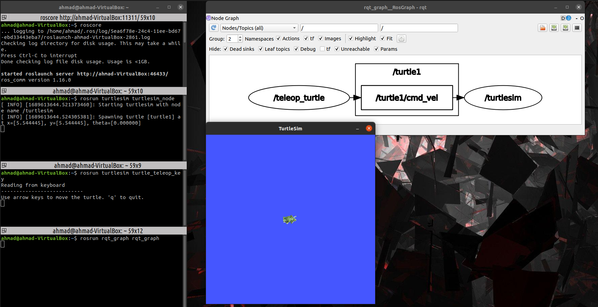

دستور زیر به ما پیام های رد بدل شده بین نودها را در داخل کنسول زیبا نمایش میدهد، همچنین امکان فیلترینگ دیتا نیز هست:

```bash
$ rosrun rqt_console rqt_console
```

خروجی این دستور به شکل زیر خواهد بود:

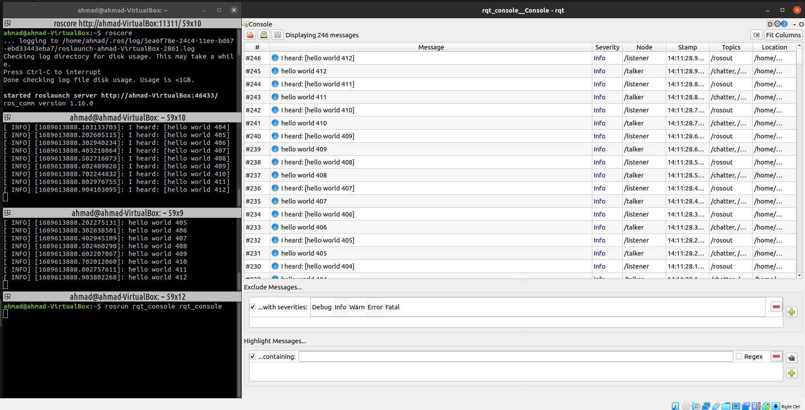

توجه شود که سطح اهمیت پیام ها به شرح زیر است:

```
debug
info
warning
error
fatal
```

که برای Api مربوط به rospy استفاده از این لاگ ها به شرح زیر می شود:

```python
rospy.logdebug(msg, *args, \*\*kwargs)
rospy.loginfo(msg, *args, **kwargs)
rospy.logwarn(msg, \*args, **kwargs)
rospy.logerr(msg, *args, \*\*kwargs)
rospy.logfatal(msg, *args, \*\*kwargs)
```

توجه شود که اگر نیاز شد از متغیری را در پیام لاگ ها چاپ کنید از فرمت زیر بهره ببرید:

```python
rospy.logerr("%s returned the invalid value %s", other_name, other_value)
```

همچنین اگر نیاز شد متغیر صحیح و فلوت لاگ شود از فرمت زیر می توانید بهره ببرید:

```python
rospy.logerr("This is a integer %d num and this is float %f", 23, 23.232)
```

برای مشاهده جزئیات بیشتر به لینک زیر مراجعه نمایید:

آشنایی با ابزارهای rqt:
http://wiki.ros.org/ROS/Tutorials/UsingRqtconsoleRoslaunch

لاگ های درپایتون: http://wiki.ros.org/rospy/Overview/Logging

لاگ ها در سی پلاس پلاس: http://wiki.ros.org/roscpp/Overview/Logging

## واحد های استاندارد

واحدهای استاندارد ROS به شرح زیر هست:

- طول و فاصله: متر
- جرم: کیلوگرم
- زمان: ثانیه
- جریان: آمپر
- اختلاف پتانسیل: ولت
- مغناطیس: تسلا
- زاویه: رادیان
- فرکانس: هرتز
- نیرو: وات
- دما: سلسیوس

بقیه واحد ها مثل سرعت و شتاب و ... از تقسیم واحد های بالا بر هم بدست می آیند.

## آشنایی با فایل های launch

در ادامه به لانچ فایل های می پردازیم که به ما این امکان را می دهند که با اجرای یک فایل، چندین نود را همزمان درون یک ترمنیال اجرا کنیم که خیلی به خلوت شدن محیط کاری کمک می کند. برای اینکار یک پوشه مجزا در پکیج مان تحت عنوان launch ایجاد می کنیم و فایل های launch مان را در داخل این پوشه قرار می دهیم:

```bash
$ roscd beginner_tuts/
$ mkdir launch
```

حال مثال می خواهیم برنامه لاکپشت را به کمک یک لانچ فایل اجرا کنیم. یک فایل با نام turtle_run.launch ایجاد می کنیم:

```bash
$ touch turtle_run.launch
```

و کد زیر را در داخل آن قرار می دهیم:

```xml
<launch>
    <node pkg="turtlesim" type="turtlesim_node" name="sim" />
    <node pkg="turtlesim" type="turtle_teleop_key" name="control" />
</launch>
```

در کد بالا 2 نود turtlesim_node و turtle_teleop_key از پکیج turtlesim قرار است اجرا شود. (توجه شود که type همان نود است) و یک نام هم به هر کدام از نود ها اختصاص می دهیم. توجه شود که قبل از اجرا کردن یک فایل launch حتما باید هسته فعال باشد ولی اگر هم فعال نبود، خود دستور roslaunch آنرا اجرا می کند. با دستور زیر می توانیم فایل لانچ ایجاد شده را اجرا کنیم:

```bash
$ roslaunch turtle_run.launch
```

همچنین توجه شود که ما می توانیم با کمک دستور زیر از سایر دایرکتوری ها فایل لانچ موجود در پکیج مدنظر را اجرا کنیم:

```bash
$ roslaunch beginner_tuts turtle_run.launch
```

درون فایل لانچ می توان از attribute ها مختلف بهره برد. یکی از این attribute ها respawn می باشد که نود را هر چند بار هم که ببندیم مجدد اجرا کند (در این مثال پنجره لاکپشت پس از هر بار بسته شدن، مجدد پس از 3 ثانیه تاخیر از نو اجرا می شود. توجه شود که تاخیر اتریبیوت اجباری نیست!)

```xml
<launch>
    <node pkg="turtlesim" type="turtlesim_node" name="sim" respawn="true" respawn_deley="3"/>
    <node pkg="turtlesim" type="turtle_teleop_key" name="control" />
</launch>
```

یا می توانیم با کمک اتریبیوت required یک نود را اجباری کنیم (در صورتیکه این نود بسته شود، کل هسته متوقف می شود.):

```xml
<launch>
    <node pkg="turtlesim" type="turtlesim_node" name="sim" required="true" />
    <node pkg="turtlesim" type="turtle_teleop_key" name="control" />
</launch>
```

یا می توانیم در صورتی که نود آرگومان ورودی دارد، برای آن مقادیری را نیز تعیین کنیم:

```xml
<launch>
    <node pkg="turtlesim" type="turtlesim_node" name="sim" args="1 2 3" />
    <node pkg="turtlesim" type="turtle_teleop_key" name="control" />
</launch>
```

یا می توانیم بگوییم در صورتیکه که یک نود اجرا شد، تمام پارامترهای قبلی ذخیره شده در رم حذف شود:

```xml
<launch>
    <node pkg="turtlesim" type="turtlesim_node" name="sim" clear_params="true" />
    <node pkg="turtlesim" type="turtle_teleop_key" name="control" />
</launch>
```

توجه شود که در زبان xml تگ هایی که تگ ها بسته شونده و تکی به شکلی زیر است:

```xml
<closing></closing>
<non-closing>
```

تگ node را می توانیم به صورت دوتایی نیز تعریف کنیم و در داخل آن از تگهای مختلف استفاده کنیم از جمله تگ env که برای تعریف مجدد متغیرهای محیط کاری تعریف می شود، مقدار name نام آن متغیر و مقدار value برابر مقدار جدیدی است که می خواهیم به آن اختصاص دهیم:

```xml
<launch>
    <node pkg="turtlesim" type="turtlesim_node" name="sim">
        <env name="Env_Varaible_Name" value="New_Value" />
    </node>
    <node pkg="turtlesim" type="turtle_teleop_key" name="control" />
</launch>
```

همچنین می توان تاپیک ها را re-map کرد (یعنی یک نام دیگر بجای نام پیشفرض تاپیک کنیم، این مورد زمانی کاربردی می شود که نیاز باشد از یک نود و تاپیک چندین بار استفاده کنیم و می خواهیم تاپیک هر نود مجزا باشد). برای مثال در مثال لاکپشت می خواهیم که تاپیک cmd_vel با نام vel2 ریمپ شود، در محیط ترمینال این ریمپ کردن به شکل زیر در می آید:

```bash
$ roscore
$ rosrun turtlesim turtlesim_node /turtle1/cmd_vel:=vel2
$ rosrun turtlesim turtle_teleop_key /turtle1/cmd_vel:=vel2
```

و در محیط لانچ فایل مثال لاکپشت به صورت زیر در می آید:

```xml
<launch>
    <node pkg="turtlesim" type="turtlesim_node" name="sim">
        <remap from="/turtle1/cmd_vel" to="vel2" />
    </node>
    <node pkg="turtlesim" type="turtle_teleop_key" name="control">
        <remap from="/turtle1/cmd_vel" to="vel2" />
    </node>
</launch>
```

همچنین می توانیم در تگ نود یک پارامتر دلخواه را تعریف کنیم تا در هنگام اجرای هسته، در فضای پارامترها اجرا شود (توجه شود نوع پارامتر می تواند str ، int ، bool ، float). در صورتیکه تعداد پارامترهای برنامه ما زیاد هست می توانیم آنرا در داخل یک فایل ذخیره کنیم و در داخل لانچ فایلمان آنرا فراخوانی کنیم. بهتر است که این فایل در یک پوشه مجزا به نام param ساخته شود:

```bash
$ roscd beginner_tuts
$ mkdir params
$ cd params/
$ touch param
```

در داخل فایل param مثلا متغیر زیر را ذخیره می کنیم:

```
hello world!
```

در ادامه در کد لانچ فایل:

```xml
<launch>
    <node pkg="turtlesim" type="turtlesim_node" name="sim">
        <remap from="/turtle1/cmd_vel" to="vel2" />
        <param name="fromFile" type="str" textfile="$(find beginner_tuts)/params/param" />

    </node>
    <node pkg="turtlesim" type="turtle_teleop_key" name="control">
        <remap from="/turtle1/cmd_vel" to="vel2" />
    </node>
</launch>
```

البته بهتر برای حالتی که قرار است تعداد زیادی پارامترا را اجرا کنیم، حتما از فرمت yaml بهره ببریم. برای اینکار یک پوشه yaml ایجاد می کنیم و پارامترهایمان را در داخل آن ذخیره کنیم:

```bash
$ roscd beginner_tuts/
$ mkdir yaml
$ cd yaml
$ touch param.yaml
```

در داخل فایل param.yaml می توانیم با کمک فرمت داده استاندارد Yaml پارامترهای مدنظرمان را تعریف کنیم، برای مثال:

```yaml
paramGroup1:
  intPAram: 1
  floatParam: 5.2323
paramGroup2:
  listParam: [1, 2, 3, "four"]
  dicParam:
    a: "This is a"
    b: "and this is b"
```

حال برای خواندن این فایل داخل لانچ فایل به ترتیب زیر عمل می کنیم:

```xml
<launch>
    <node pkg="turtlesim" type="turtlesim_node" name="sim">
        <remap from="/turtle1/cmd_vel" to="vel2" />
        <param name="fromFile" type="str" textfile="$(find beginner_tuts)/params/param" />
        <rosparam command="load" file="$(find beginner_tuts)/yaml/param.yaml" />

    </node>
    <node pkg="turtlesim" type="turtle_teleop_key" name="control">
        <remap from="/turtle1/cmd_vel" to="vel2" />
    </node>
</launch>
```

و برای اجرا همانند سابق عمل می کنیم:

```bash
$ roslaunch beginner_tuts turtle_run.launch
```

همچنین با کمک تگ rosparam نیز می توانیم متغیر خاصی در محیط مقدار دهی کنیم، به شکل زیر:

```xml
<launch>
    <node pkg="turtlesim" type="turtlesim_node" name="sim">
        <rosparam param="NN">1212</rosparam>
    </node>
    <node pkg="turtlesim" type="turtle_teleop_key" name="control">
        <remap from="/turtle1/cmd_vel" to="vel2" />
    </node>
</launch>
```

برای لانچ فایل ها نیز می توان آرگومان ورودی تعریف کرد، یعنی کاری کرد که هنگام اجرای یک لانچ فایل در ترمینال ورودی از آن بگیریم. در مثال زیر فایل لانچ یک آرگومان می گیرد و آنرا در متغیری به نام myArg ذخیره می کند که در جای جای فایل لانچ قابل استفاده است (می توان یک مقدار دیفالت نیز تعریف کرد):

```xml
<launch>
    <arg name="myArg" default="[2,3]" />

    <node pkg="turtlesim" type="turtlesim_node" name="sim">
        <remap from="/turtle1/cmd_vel" to="vel2" />
        <param name="fromFile" type="str" textfile="$(find beginner_tuts)/params/param" />
        <rosparam command="load" file="$(find beginner_tuts)/yaml/param.yaml" />
        <param name="NN" value="$(arg myArg)" />
    </node>
    <node pkg="turtlesim" type="turtle_teleop_key" name="control">
        <remap from="/turtle1/cmd_vel" to="vel2" />
    </node>

</launch>
```

همچنین در فایل های لانچ می توانیم یک فایل لانچ دیگر را فراخوانی و اینکلود کنیم:

```xml
<launch>
    <include file="$(find beginner_tuts)/launch/somefile.launch" />
    ...
</launch>
```

پس از اینکلود کردن، قبل از اجرای بدنه اصلی لانچ فایل، فایل اینکلود شده اجرا می شود. برای کامنت کردن در فایل xml از همان روش html بهره می بریم:

```xml
<!-- my comment -->
```

همچنین می توانیم یک فایل لانچ را با نیم اسپیس های گوناگون (ns) گروپ بندی کنیم (زیاد کاربردی نداره ولی بد نیست بدونیم):

```xml
<launch>
    <group ns="group1">
    <node pkg="turtlesim" type="turtlesim_node" name="sim">
        <remap from="/turtle1/cmd_vel" to="vel2" />
        <param name="fromFile" type="str" textfile="$(find beginner_tuts)/params/param" />
        <rosparam command="load" file="$(find beginner_tuts)/yaml/param." />

    </node>
    <node pkg="turtlesim" type="turtle_teleop_key" name="control">
        <remap from="/turtle1/cmd_vel" to="vel2" />
    </node>
    </group>

    <group ns="group2">
        .... other nodes ...
    </group>

</launch>
```

برای مشاهده جزئیات بیشتر به داکیومنت راس مراجعه نمایید:

http://wiki.ros.org/roslaunch

http://wiki.ros.org/ROS/Tutorials/UsingRqtconsoleRoslaunch

## آشنایی با TFها

در این قسمت قصد پرداختن به tf ها را داریم که کمتر به آنها پرداخته می شود. tf ها در واقع همان دستگاه های مختصاتی هستند که به ربات و اجزاء مختلف آن می چسبند و برای محاسبات رباتیکی مورد استفاده قرار می گیرند. برای آشنایی اولیه با tf ها ابتدا یک مثال اجرا می کنیم:

```bash
$ roslaunch turtle_tf turtle_tf_demo.launch
```

بعد مشابه این لانچ فایل خودمان ایجاد می کنیم و خروجی را مشاهده میک کنیم. با کمک دستور زیر می توانیم لیست tf ها فعال در برنامه را به صورت نموداری مشاهده کنیم:

```bash
$ rosrun rqt_tf_tree rqt_tf_tree
```

برای بدست آوردن اختلاف مکانی دو tf می توانیم از دستور زیر بهره ببریم:

```bash
$ rosrun tf tf_echo turtle1 turtle2
```

اختلاف موقعیت در دستگاه های مختلف به ما داده می شود.

به برنامه ای که یک tf را درون تاپیک منتشر می کند، به اصطلاح tf broadcaster می گویند که نحوه ایجاد کردن آن به کمک سی پلاس پلاس و پایتون را توضیح می دهیم. بدین منظور یک پکیج مجزاء از پکیج beginner_tuts ایجاد می کنیم:

```bash
$ cd Desktop/catkin_ws/src/
$ catkin_create_pkg learning_tf tf rospy roscpp turtlesim
$ cd ..
$ catkin_make
```

توجه شود که چون ما قبلا این ورک اسپس را در فایل .bashrc معرفی کرده ایم نیاز به این سورس کردن مجدد نیست. در ابتدا می خواهیم این برنامه را با کمک سی پلاس پلاس بنویسیم، پس ابتدا وارد پوشه مربوطه شده و یک فایل سی پلاس پلاس می شویم:

```bash
$ cd src/learning_tf/src/
$ touch turtle_tf_broadcaster.cpp
```

کد مربوط به فایل سی پلاس پلاس برادکستر به شکل زیر می باشد (توضیحات مربوطه کامنت شده است)؛ در کد زیر یک تابع کالبک موجود است و یک تابع اصلی، در تابع اصلی ابتدا یک نود ایجاد کرده و سپس ورود یک آرگومان را برای آن ضروری می کنیم (که آرگومان ورودی، نام لاکپشت است). سپس در داخل تاپیک پوزیشن لاکپشت سابسکرایب می کنیم و اطلاعات لاکپشت را به تابع poseCallback پاس می دهیم. درون این تابع نیز ابتدا یک آبجکت برادکستر می سازیم و سپس مختصات کارتزین و زوایه ای را در فرمت استاندارد tf ها ذخیره کرده و در نهایت آنرا برادکست می کنیم:

```c++
#include <ros/ros.h>
#include <tf/transform_broadcaster.h> // For creating tf
#include <turtlesim/Pose.h> // Reading Pose of turtles from pose topic


std::string turtle_name; // Name of turtle as string value


// We make this call-back fcn for excute after receiving data from "pose" topic
void poseCallback(const turtlesim::PoseConstPtr& msg)
{
  // Create A Transform Broadcaster Obj
  static tf::TransformBroadcaster br;


  // Katezian Specs.
  tf::Transform transform;
  transform.setOrigin( tf::Vector3(msg->x, msg->y, 0.0) ); // x y z


  // Angular Specs.
  tf::Quaternion q;
  q.setRPY(0, 0, msg->theta); // roll pitch yaw
  transform.setRotation(q);


  // Broadcaster The Created Tf
  br.sendTransform(tf::StampedTransform(transform, ros::Time::now(), "world", turtle_name));
}


// Main Fcn
int main(int argc, char** argv)
{
  ros::init(argc, argv, "my_tf_broadcaster"); // Create Node

  // At least one argument needed, Arg #1 => turtle_name
  if (argc != 2){ROS_ERROR("need turtle name as argument"); return -1;};
  turtle_name = argv[1];


  ros::NodeHandle node;
  // Subscibe to turtle#/pose and pass it to "poseCallback" fcn
  ros::Subscriber sub = node.subscribe(turtle_name+"/pose", 10, &poseCallback);


  ros::spin();
  return 0;
};
```

همچنین کد زیر را به فایل CMakeLists.txt اضافه می کنیم تا فایل سی پلاس پلاس ما قابلیت اجرایی پیدا کند:

```c
add_executable(turtle_tf_broadcaster src/turtle_tf_broadcaster.cpp)
target_link_libraries(turtle_tf_broadcaster ${catkin_LIBRARIES})
```

در بهتر است برای این پکیج نیز یک فایل لانچ ایجاد کنیم چرا که همزمان قرار است برنامه لاکپشت را نیز اجرا کنیم، یک فایل لانچ در پوشه لانچ با نام start_demo.launch ایجاد میکنم و کد زیر را در داخل آن قرار می دهیم:

```xml
<launch>
    <!-- Turtlesim Node-->
    <node pkg="turtlesim" type="turtlesim_node" name="sim"/>
    <node pkg="turtlesim" type="turtle_teleop_key" name="teleop" output= "screen"/>


    <node pkg="learning_tf" type="turtle_tf_broadcaster"
          args="/turtle1" name="turtle1_tf_broadcaster" />


    <node pkg="learning_tf" type="turtle_tf_broadcaster"
          args="/turtle2" name="turtle2_tf_broadcaster" />

</launch>
```

توجه شود که در این مرحله برای ما فقط یک لاکپشت turtle1 ایجاد می شود و مختصات آن نسبت به world در تاپیک tf چاپ می شود. در ادامه به نحوه اجرای این کد در زبان پایتون توضیحات ارایه خواهد شد.

خروجی این برنامه به شکل زیر خواهد بود:

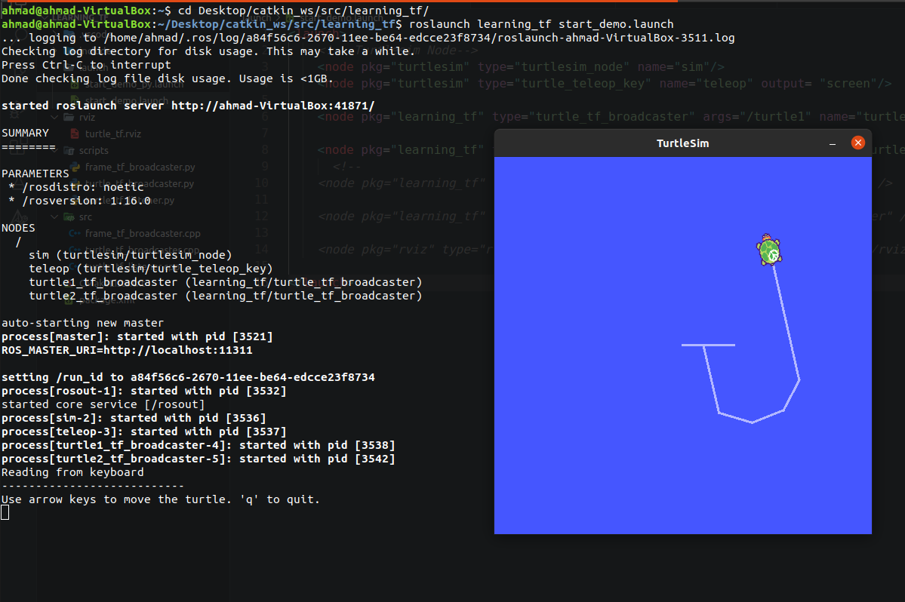

همچنین با دستور rqt_tf_tree می توان لیست tfها را نسبت به صورت درختی مشاهده کرد:

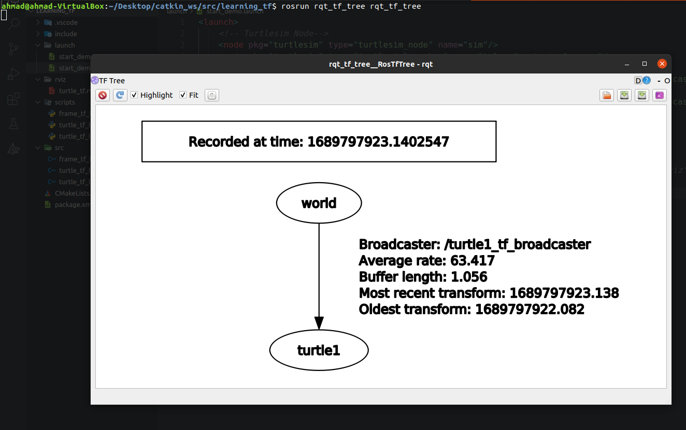

توجه شود که در این مرحله برای ما فقط یک لاکپشت turtle1 ایجاد می شود و مختصات آن نسبت به world در تاپیک tf چاپ می شود. در ادامه به نحوه اجرای این کد در زبان پایتون توضیحات ارایه خواهد شد.

در ادامه قصد داریم برنامه برابدکستر را با پایتون نگارش کنیم. برای اینکار یک پوشه با نام script در دایرکتوری اصلی می سازیم و یک فایل پایتون با نام اجرا می کنیم:

```py
#!/usr/bin/env python
import roslib
roslib.load_manifest('learning_tf')
import rospy


import tf
import turtlesim.msg # Importing Turtlesim Messages


# Call-Back Fcn.
def handle_turtle_pose(msg, turtlename):
    # Make a tf broadcaster object
    br = tf.TransformBroadcaster()


    # Broadcasting the tf in standard format
    br.sendTransform((msg.x, msg.y, 0),
                     tf.transformations.quaternion_from_euler(0, 0, msg.theta),
                     rospy.Time.now(),
                     turtlename,
                     "world")


# Main Fcn.
if __name__ == '__main__':
    # Initiate A Node
    rospy.init_node('turtle_tf_broadcaster')


    # Read The Turtle Name
    turtlename = rospy.get_param('~turtle')


    # Subscribe in /turtle#/pose and pass it to handle_turtle_pose
    rospy.Subscriber('/%s/pose' % turtlename,
                     turtlesim.msg.Pose,
                     handle_turtle_pose,
                     turtlename)
    rospy.spin()
```

حتما پوشه فایل اسکریپ تا را با کامند زیر اجرا پذیر کنید:

```bash
$ chmod +x scripts/
```

برای اجرای راحتر کد زیر را درون فایل لانچ قرار می دهیم:

```xml
<launch>
    <!-- Turtlesim Node-->
    <node pkg="turtlesim" type="turtlesim_node" name="sim"/>
    <node pkg="turtlesim" type="turtle_teleop_key" name="teleop" output="screen"/>


    <node name="turtle1_tf_broadcaster" pkg="learning_tf" type="turtle_tf_broadcaster.py" respawn="false" output="screen" >
      <param name="turtle" type="string" value="turtle1" />
    </node>
    <node name="turtle2_tf_broadcaster" pkg="learning_tf" type="turtle_tf_broadcaster.py" respawn="false" output="screen" >
      <param name="turtle" type="string" value="turtle2" />
    </node>
</launch>
```

خروجی مشابه فایل سی پلاس پلاس خواهد بود. در ادامه قصد داریم لاکپشت دوم را نیز به برنامه اضافه کنیم؛ به گونه ای که لاکپشت اول اگر حرکت کرد، لاکپشت دوم آنرا دنبال کند. یک فایل سی پلاس پلاس جدید به نام turtle_tf_listener.cpp ایجاد می کنیم و کد زیر را در داخل آن قرار می دهیم. (کامنت ها گذاری شده):

```c
#include <ros/ros.h>
#include <tf/transform_listener.h>
#include <geometry_msgs/Twist.h>
#include <turtlesim/Spawn.h> // Fpr making new turtle


// Main loop
int main(int argc, char** argv){
  ros::init(argc, argv, "my_tf_listener"); // Initiate node


  ros::NodeHandle node;


  // Use turtlesim spawn service to make a new turtle
  ros::service::waitForService("spawn");


  // Make a client for spawn service
  ros::ServiceClient add_turtle =
   node.serviceClient<turtlesim::Spawn>("spawn");
  turtlesim::Spawn srv;


  // Calling service for adding new turtle => name: turtle2
  add_turtle.call(srv);


  // Make a topic publisher (turtle2/cmd_vel)
  ros::Publisher turtle_vel =
    node.advertise<geometry_msgs::Twist>("turtle2/cmd_vel", 10);


  // Create a tf listner for finding relative pose betwen turtle1 & turtle2
  tf::TransformListener listener;


  ros::Rate rate(10.0);
  while (node.ok()){
    tf::StampedTransform transform;
    try{
      ros::Time now = ros::Time::now();
      ros::Time past = now - ros::Duration(5.0);


      // Wait for calc of t1 & t2 pose
      listener.waitForTransform("/turtle2", now ,"/turtle1",past , "/world" ,ros::Duration(1.0));


      //  Find the diff. pose betwen t1 & t2 and put it in transform obj.
      listener.lookupTransform("/turtle2", now, "/turtle1", past,"/world" , transform);
    }
    catch (tf::TransformException &ex) {
      ROS_ERROR("%s",ex.what());
      ros::Duration(1.0).sleep();
      continue;
    }


    // Calc of linear and angular velocity
    geometry_msgs::Twist vel_msg;
    vel_msg.angular.z = 8.0 * atan2(transform.getOrigin().y(),
                                    transform.getOrigin().x());
    vel_msg.linear.x = 1.0 * sqrt(pow(transform.getOrigin().x(), 2) +
                                  pow(transform.getOrigin().y(), 2));
    turtle_vel.publish(vel_msg);


    rate.sleep();
  }
  return 0;
};
```

همچنین کد زیر را در CMakeList.txt اضافه می کنیم:

```c
add_executable(turtle_tf_listener src/turtle_tf_listener.cpp)
target_link_libraries(turtle_tf_listener ${catkin_LIBRARIES})
```

و کد مربوط به لانچ فایل را به صورت زیر تغییر می دهیم (نود مربوط به لاکپشت دوم اضافه شد):

```xml
<launch>
    <!-- Turtlesim Node-->
    <node pkg="turtlesim" type="turtlesim_node" name="sim"/>
    <node pkg="turtlesim" type="turtle_teleop_key" name="teleop" output= "screen"/>


    <node pkg="learning_tf" type="turtle_tf_broadcaster" args="/turtle1" name="turtle1_tf_broadcaster" />


    <node pkg="learning_tf" type="turtle_tf_broadcaster" args="/turtle2" name="turtle2_tf_broadcaster" />

    <node pkg="learning_tf" type="turtle_tf_listener" name="turtle2_tf_listener" />


</launch>
```

حال لانچ فایل را اجرا می کنیم. همچنین در یک ترمینال مجزاء نمودار درختی tfها را به نمایش می گذاریم. خروجی به شکل زیر خواهد بود:

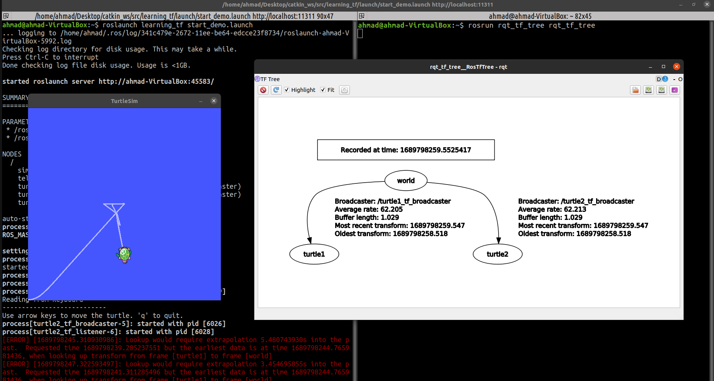

حالا با کمک پایتون این کار را انجام می دهیم. یک فایل جدید با نام turtle_tf_listener.py ایجاد می کنیم و کد زیر را در داخل آن قرار می دهیم. کد پایین یک پابلیشر ایجاد کرده و با محاسبه اختلاف مکانی و زاویه ای بین دو لاکپشت یک سرعت خطی و زاویه محاسبه در تاپیک turtle2/cmd_vel پابلیش می کند:

```py
#!/usr/bin/env python3
import roslib
roslib.load_manifest('learning_tf')
import rospy
import math
import tf
import geometry_msgs.msg
import turtlesim.srv


if __name__ == '__main__':


    # Initizate The Node
    rospy.init_node('turtle_tf_listener')


    # Create tf listner obj.
    listener = tf.TransformListener()


    # Make new turtle using spawn service
    rospy.wait_for_service('spawn')
    spawner = rospy.ServiceProxy('spawn', turtlesim.srv.Spawn)
    spawner(4, 2, 0, 'turtle2') # Turtle2 position


    # Create publisher for publish data in trutlesim "turtle2/cmd_vel" topic
    turtle_vel = rospy.Publisher('turtle2/cmd_vel', geometry_msgs.msg.Twist,queue_size=1)


    # Find diff. pose betwen 2 trutle
    rate = rospy.Rate(10.0)
    while not rospy.is_shutdown():
        try:
            now = rospy.Time.now()
            past = now - rospy.Duration(5.0)
            #listener.waitForTransformFull("/turtle2", now,"/turtle1", past,"/world", rospy.Duration(1.0))
            #(trans, rot) = listener.lookupTransformFull("/turtle2", now,"/turtle1", past,"/world")

            (trans, rot) = listener.lookupTransformFull('/turtle2',rospy.Time(0),'/turtle1', rospy.Time(0), "/world")


        except (tf.LookupException,  tf.ConnectivityException,  tf.ExtrapolationException):
            continue


        # Calc Angular and Linear velocity
        angular = 4 * math.atan2(trans[1], trans[0])
        linear = 0.5 * math.sqrt(trans[0] ** 2 + trans[1] ** 2)
        cmd = geometry_msgs.msg.Twist()
        cmd.linear.x = linear
        cmd.angular.z = angular


        # Publish data to "turtle2/cmd_vel" topic
        turtle_vel.publish(cmd)


        rate.sleep()
```

فایل لانچ پایتونی هم به شکل زیر تغییر می کند:

```xml
<launch>
    <!-- Turtlesim Node-->
    <node pkg="turtlesim" type="turtlesim_node" name="sim"/>
    <node pkg="turtlesim" type="turtle_teleop_key" name="teleop" output="screen"/>


    <node name="turtle1_tf_broadcaster" pkg="learning_tf" type="turtle_tf_broadcaster.py" respawn="false" output="screen" >
      <param name="turtle" type="string" value="turtle1" />
    </node>
    <node name="turtle2_tf_broadcaster" pkg="learning_tf" type="turtle_tf_broadcaster.py" respawn="false" output="screen" >
      <param name="turtle" type="string" value="turtle2" />
    </node>


    <node name="listener" pkg="learning_tf" type="turtle_tf_listener.py" respawn="false" output="screen" >
    </node>
</launch>
```

فایل لانچ را اجرا می کنیم. خروجی مشابه برنامه سی پلاس پلاس خواهد بود.

تا الان ما تمام فریم هایی که ایجاد کردیم نسبت به world بود ولی می توانیم نسبت به یک فریم دلخواه (مثلا turtle1) یک فریم را ایجاد کنیم. برای این کار یک فایل با نام frame_tf_broadcaster.cpp ایجاد کرده و کد زیر را در داخل آن قرار می دهیم (یک tf جدید ایجاد شده و برادکست می شود)

```c
#include <ros/ros.h>
#include <tf/transform_broadcaster.h>

int main(int argc, char\*\* argv){
ros::init(argc, argv, "my_tf_broadcaster");
ros::NodeHandle node;

tf::TransformBroadcaster br;
tf::Transform transform;

ros::Rate rate(10.0);
while (node.ok()){
transform.setOrigin( tf::Vector3(0.0, 2.0, 0.0) ); // relative kartezian pose to turtle1
transform.setRotation( tf::Quaternion(0, 0, 0, 1) ); // relative angular pose to turtle1

    // Make new frame relative to turtle1 with the name of carrot1
    br.sendTransform(tf::StampedTransform(transform, ros::Time::now(), "turtle1", "carrot1"));
    rate.sleep();

}
return 0;
};
```

فراموش نشود که کد زیر در انتهای فایل CMakeList.txt اضافه شود:

```c
add_executable(frame_tf_broadcaster src/frame_tf_broadcaster.cpp)
target_link_libraries(frame_tf_broadcaster ${catkin_LIBRARIES})
```

می توان از این tf جدید در جاهای مختلف استفاده کرد، برای مثال می توان در برنامه دنبال روی لاکپشت ها از carrot1 بجای turtle1 بهره ببریم. این فایل را هم به لانچ فایل اضافه می کنیم:

```xml
<launch>
    <!-- Turtlesim Node-->
    <node pkg="turtlesim" type="turtlesim_node" name="sim"/>
    <node pkg="turtlesim" type="turtle_teleop_key" name="teleop" output= "screen"/>

    <node pkg="learning_tf" type="turtle_tf_broadcaster" args="/turtle1" name="turtle1_tf_broadcaster" />

    <node pkg="learning_tf" type="turtle_tf_broadcaster" args="/turtle2" name="turtle2_tf_broadcaster" />

    <node pkg="learning_tf" type="turtle_tf_listener" name="turtle2_tf_listener" />

    <node pkg="learning_tf" type="frame_tf_broadcaster" name="frame_tf_broadcaster" />
</launch>
```

حال برنامه را اجرا می کنیم. خروجی به شکل زیر خواهد بود:

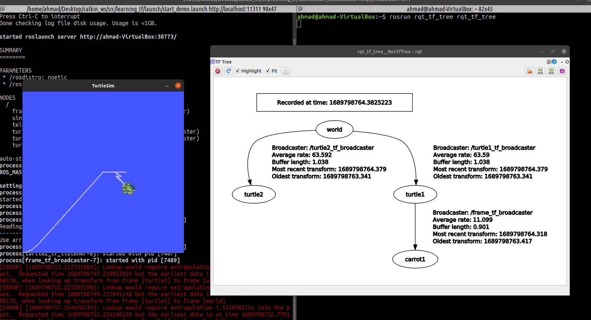

فرآیند اضافه کردن فریم با کمک پایتون نیز کاملا مشابه است، یک فایل پایتون با نام frame_tf_broadcaster.py ایجاد می کنیم و کد زیر را در داخل آن قرار می دهیم:

```py
#!/usr/bin/env python3
import roslib
roslib.load_manifest('learning_tf')


import rospy
import tf


if __name__ == '__main__':
    rospy.init_node('fixed_tf_broadcaster')
    br = tf.TransformBroadcaster()
    rate = rospy.Rate(10.0)
    while not rospy.is_shutdown():
        br.sendTransform((0.0, 2.0, 0.0),
                         (0.0, 0.0, 0.0, 1.0),
                         rospy.Time.now(),
                         "carrot1",
                         "turtle1")
        rate.sleep()

```

سپس داخل لانچ فایل پایتونی را به این شکل تغییر می دهیم:

```xml
<launch>
    <!-- Turtlesim Node-->
    <node pkg="turtlesim" type="turtlesim_node" name="sim"/>
    <node pkg="turtlesim" type="turtle_teleop_key" name="teleop" output="screen"/>


    <node name="turtle1_tf_broadcaster" pkg="learning_tf" type="turtle_tf_broadcaster.py" respawn="false" output="screen" >
      <param name="turtle" type="string" value="turtle1" />
    </node>
    <node name="turtle2_tf_broadcaster" pkg="learning_tf" type="turtle_tf_broadcaster.py" respawn="false" output="screen" >
      <param name="turtle" type="string" value="turtle2" />
    </node>


    <node name="listener" pkg="learning_tf" type="turtle_tf_listener.py" respawn="false" output="screen" >
    </node>


    <node name="frame_tf_broadcaster" pkg="learning_tf" type="frame_tf_broadcaster.py" respawn="false" output="screen" />

</launch>
```

گاها نیاز می شود که یک tf ثابت نسبت به یک tf دیگر ایجاد کنیم. همانند مثال قبلی که carrot1 را نسبت به turtle1 تعریف کردیم. برای تعریف اینگونه از tf ها استاتیک (که نسبت به یک فریم دیگر کاملا ثابت هستند) نیاز به تعریف برنامه مستقل نیست و می توان با کمک لانچ فایل این کار را انجام داد برای مثال نود زیر یک فریم ثابت نسبت به فریم turtle1 تعریف می کند که موقعیت نسبتی آن با ترتیب x y z برابر 0 2 0 و مشخصات کواتریون 0 0 0 1 تعریف می شود (w=1) و این کار با فرکانس 100 صورت می پذیرید، نام فریم جدید هم carrot1 است:

```xml
<node pkg="tf" type="static_transform_publisher" args="0 2 0 0 0 0 1 turtle1 carrot1 100 name="frame1" />
```

بهتر است همیشه بجای اویلر از کواترنیون استفاده کنیم. استانداراد راس در محیط سه بعدی کواترنیون است.

در ادامه در مورد rviz صحبت شد که یک ابزار گرافیکی برای نمایش داده ها می باشد. با کمک کامند Rviz می توانید این محیط را باز نمایید. در شاخه کناری Display می توانید لیست موارد نمایشی را کنترل کنید. حتما Fixed Frame را بر روی world قرار دهید و با دکمه Add لیست tf ها را اضافه نمایید. خروجی به شکل زیر خواهد بود:

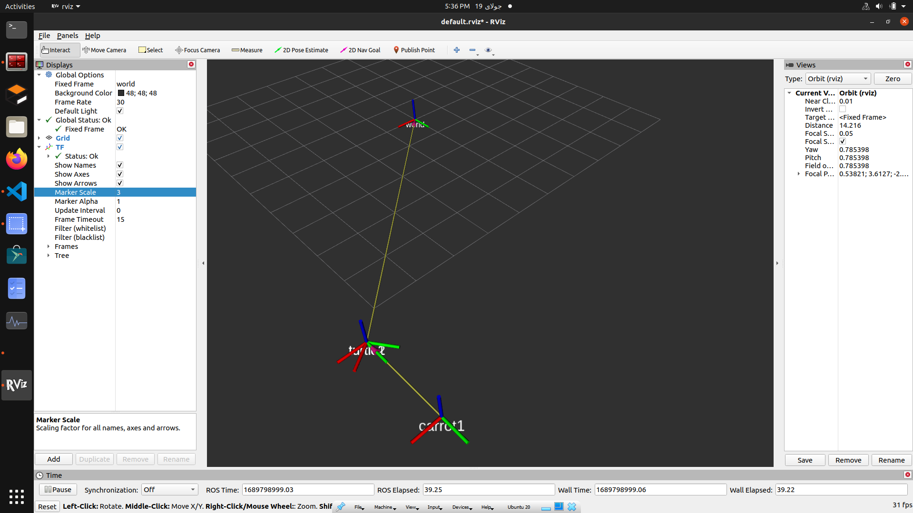

برای ذخیره همین ستاپ نمایشی کافیست از منوی File گزینه Save Config As .. اقدام نمایید. بهتر است یک پوشه در پکیج خود تحت عنوان rviz ایجاد کنیم و فایل های rviz را در داخل آن ذخیره کنیم. برای اضافه کردن نود rviz به فایل لانچ به ترتیب زیر عمل می کنیم:

```xml
<launch>
    <!-- Turtlesim Node-->
    <node pkg="turtlesim" type="turtlesim_node" name="sim"/>
    <node pkg="turtlesim" type="turtle_teleop_key" name="teleop" output= "screen"/>

    <node pkg="learning_tf" type="turtle_tf_broadcaster" args="/turtle1" name="turtle1_tf_broadcaster" />


    <node pkg="learning_tf" type="turtle_tf_broadcaster" args="/turtle2" name="turtle2_tf_broadcaster" />

    <node pkg="learning_tf" type="turtle_tf_listener" name="turtle2_tf_listener" />


    <node pkg="learning_tf" type="frame_tf_broadcaster" name="frame_tf_broadcaster" />

    <node pkg="rviz" type="rviz" name="vizualiator" args="-d $(find learning_tf)/rviz/turtle.rviz" />

</launch>
```

برای مشاهده جزئیات بیشتر در مورد tf به داکیومنت راس مراجعت نمایید

http://wiki.ros.org/tf/Tutorials

## زمان در ROS

در ابتدای این بخش قصد داریم تا در مورد زمان ها صحبت کنیم. برای دریافت زمان حال (آبجکت begin) در سی پلاس پلاس به ترتیب زیر عمل می کنیم:

```c++
ros::Time begin = ros::Time::now();
ROS_INFO("Seconds from 1/1/1970 = %d and nanaoSeconds = %d", begin.sec, begin.nsec)
```

برای دریافت دریافت زمان حال در زبان پایتون به شکل زیر عمل می کنیم:

```py
now = rospy.get_rostime()
rospy.loginfo("Current time %i %i", now.secs, now.nsecs)
```

برای دریافت به صورت متغیر float در سی پلاس پلاس به شکل زیر:

```c++
double secs =ros::Time::now().toSec();
```

و در پایتون به شکل زیر عمل می کنیم:

```py
seconds = rospy.get_time()
```

برای تعریف یک زمان خاص (Time) (توجه شود که با Duration متفاوت است) خاص می توانید از تابع دو حالت زیر استفاده کنید:

```c++
ros::Time a_little_after_the_beginning(0.001); // in Seconds

// or

ros::Time a_little_after_the_beginning(0, 1000000); // in (Seconds, nanoSeconds)
```

در پایتون نیز به شکل زیر ایجاد می شود:

```py
t = rospy.Time.from_sec(123456.789) # 123456 seconds and 789000000 nano-seconds

# or

t = rospy.Time(12345, 6789) # 12345 seconds and 6789 nano-seconds
```

اکنون که به نحوه ایجاد یک زمان خاص یا به اصطلاح Time پرداختیم می توانیم به نحوه ایجاد یک بازه زمانی خاص یا به اصطلاح Duration بپردازیم. برای مثال در کد سی پلاس پلاس زیر 60.1 ثانیه را به دو روش در آبجکت five_seconds ذخیره کرده ایم:

```c++
ros::Duration five_seconds(60.1);

// or

ros::Duration five_seconds(60, 100000000);
```

در پایتون نیز به شکل زیر است:

```py
d = rospy.Duration.from_sec(60.1)
```

برای مثال از Duration می توانیم برای متوقف کردن برنامه برای بازه زمانی خاص استفاده کنیم. برای مثال کد زیر در سی پلاس پلاس برنامه را برای 10 ثانیه متوقف می کند:

```c++
ros::Duration(0.5).sleep(); // sleep for half a second
```

در پایتون به دو شکل زیر امکان پذیر است:

```py
# sleep for 10 seconds
rospy.sleep(10.)

# or

# sleep for duration
d = rospy.Duration(10, 0)
rospy.sleep(d)
```

همچنین می توانیم به صورت فرکانسی از زمان استفاده کنیم (مثلا بگویم برنامه با فرکانسی خاص متوقف شود) که در اینجا از Rate بهره می بریم. کد سی پلاس پلاس به ترتیب زیر است:

```c++
ros::Rate r(10); // 10 hz
while (ros::ok())
{
  ... do some work ...
  r.sleep();
}
```

و کد پایتون به ترتیب زیر است:

```py
r = rospy.Rate(10) # 10hz
while not rospy.is_shutdown():
    pub.publish("hello")
    r.sleep()
```

توجه شود که اگر منطق های زیر در اعمال جبری جمع و تفریق زمانی برقرار است:

```
D = Duration
T = Time

---

D+D = D
D-D = D
T+D = T
T-D = T
T-T = D
T+T = Not Defined
```

در ادامه در مورد تایمر را ها صحبت می کنیم. تایمر زمانی استفاده می شود که ما قصد داریم یک کار را با فاصله زمانی خاص انجام دهیم. برای مثال متد زیر در بازه زمانی تعریف شده برای ما تابع timerCallback را اجرا می کند:

```c++
ros::Timer timer = nh.createTimer(ros::Duration(0.1), timerCallback);
```

همچنین می توانیم تایمر را به گونه ای تعریف کنیم که فقط یک بار اجرا شود، فقط کافی است که bool_oneshot را برابر false قرار دهیم:

```c++
ros::Timer ros::NodeHandle::createTimer(ros::Duration period, <callback>, bool oneshot = false);
```

همچنین اگر بخواهیم یک تایمر را متوقف کنیم می توانیم از دستور زیر استفاده کنیم:

```py
timer.stop()
```

همچنین برای شروع مجدد تایمر می توانیم از تابع .start() استفاده کنیم. پس در جمع بندی یک تابع کال بک داریم و یک تایمر که آن تابع را در بازه زمانی که ما برایش مشخص کردیم اجرا می کند:

```c++

void callback(const ros::TimerEvent& event)
{
...
}

...
ros::Timer timer = nh.createTimer(ros::Duration(0.1), callback);
```

اگر قرار بود از متدی به عنوان تابع کال بک استفاده کنیم (برای مثال متد callback از کلاس foo که آبجکت foo_object از این کلاس است) کافی است که به شیوه زیر متد کال بک و آبجکت را به تایمر بدهیم:

```c++
class Foo
{
public:
  void Foo::callback(const ros::TimerEvent& event)
  {
  ...
  }

  ros::Timer timer;
};

...
// then, during initialization, etc
timer = nh.createTimer(ros::Duration(0.1), &Foo::callback, &foo_object);

...
Foo foo_object;
```

اکنون به سراغ ایجاد این تایمرها به زبان پایتون می رویم:

```py
def my_callback(event):
print 'Timer called at ' + str(event.current_real)

rospy.Timer(rospy.Duration(2), my_callback)
```

برای متوقف کردن تایمر می توانیم از متد زیر بهره ببریم:

```py
t = rospy.Timer(rospy.Duration(2), my_callback)
t.shutdown()
```

## اجرای تحت شبکه ROS

برای راه اندازی راس در شبکه کافی است بدانیم که هسته در کامیپوتر master اجرا می شود و امکان پخش کردن نودها در کامیپوتر های slave امکان پذیر است.

```
این بخش ناقص است و تکمیل خواهد شد
```

## ارتباط Action در محیط ROS

در ادامه قصد داریم در مورد نحوه ارتباطی actionlib توضیح بدهیم. تفاوت اکشن لیب با سرویس این است که در سرویس ها هنگامی که request ارسال می شود، تا بازگشت respond برنامه متوقف است ولی در actionlib درخواست ارسال شده ولی تا زمان بازگشت پاسخ، برنامه متوقف نمی شود و برنامه اصلی در حال اجرا می ماند. حتی در این نوع ارتباطی تا قبل از بازگشت پاسخ، سرویس actionlib می تواند فیدبک بدهد.

نکته: در این روش اکشن، سرور و کلاینت را داریم؛ به پیامی که از نود کلاینت به سرور ارسال می شود هدف (یا Goal) می گویند و به پیامی که سرور در جواب به کلاینت ارسال می کند نتیجه (یا Result) می گویند. همچنین همانگونه که ذکر شد، در روش اکشن سرور تا قبل ارسال نتیجه می تواند بازخوردهای لحظه ای (یا Feedback) نیز بدهد.

در ادامه به نحوه ایجاد سرور و کلاینت اکشن در زبان های پایتون و سی پلاس پلاس خواهیم پرداخت. بهتر است برای اینکار یک پکیج مجزاء بسازیم تا کد هایمان قاطی نشوند:

```bash
$ cd catkin_ws/
$ catkin_create_pkg actionlib_tutorials actioblib rospy roscpp message_generation std_msgs actionlib_msgs
```

توجه شود که در اکشن ها نیز ما نوع مسیج خود را همانند سرویس ها طراحی می کنیم (ساختار هدف، بازخورد و نتیجه را مشخص می کنیم)، پس خوب است یک پوشه برای این مسیج های اختصاصی با نام action در پکیج خود ایجاد کنیم:

```bash
$ mkdir actionlib_tutorials/action
```

در مثالی که قصد پیاده سازی آنرا داریم، می خوایم یک اکشن ایجاد کنیم که برای ما سری فیبوناچی را ارسال کند. بدین منظور مسیج اختصاصی این اکشن را ایجاد میکنیم:

```bash
$ touch actionlib_tutorials/action/Fibonacci.action
```

درون این فایل ساختار هدف، فیدبک و نتیجه را مشخص می کنیم:

```py
#goal definition
int32 order
---
#result definition
int32[] sequence
---
#feedback
int32[] sequence
```

در کد بالا order به ما اکشن می فهماند که تا چه عددی از سری فیبوناچی را باید محاسبه کند که عدد تکی int32 را برای نوع آن قرار داده ایم، برای بدست آوردن نتیجه از یک آرایه int32 با نام sequence استفاده می کنیم و برای فیدبک نیز از همان sequence استفاده میکنیم. حالا به فایل CMakeList.txt می رویم، حتما چک کنید که پکیج های زیر موجود باشند:

```
find_package(catkin REQUIRED COMPONENTS
  actioblib
  actionlib_msgs
  message_generation
  roscpp
  rospy
  std_msgs
)
```

در بخش مربوط به اکشن هم متد add_action_files() را از حالت کامنت در می آوریم و نام فایل اکشن موجود در پوشه action را اضافه می کنیم:

```
## Generate actions in the 'action' folder
 add_action_files(
  FILES
  Fibonacci.action
 )
```

در بخش generation_message هم actionlib_msgs و std_msgs را از حالت کامنت در می آوریم:

```
## Generate added messages and services with any dependencies listed here
 generate_messages(
   DEPENDENCIES
   actionlib_msgs
   std_msgs
 )
```

در بخش catkin_package هم خط مربوط به اکشن را به صورت زیر از حالت کامت در می آوریم:

```
catkin_package(
#  INCLUDE_DIRS include
#  LIBRARIES actionlib_tutorials
  CATKIN_DEPENDS actioblib actionlib_msgs message_generation roscpp rospy std_msgs
#  DEPENDS system_lib
)
```

این فایل را ذخیره کرده و به داخل فایل package.xml می رویم. در این فایل در داخل تگ <package> در زیر پیش نیاز std_msg، پیش نیاز زیر را نیز وارد می کنیم:

```xml
<?xml version="1.0"?>
<package format="2">
  <name>actionlib_tutorials</name>
  <version>0.0.0</version>
  <description>The actionlib_tutorials package</description>
  <maintainer email="ahmad@todo.todo">ahmad</maintainer>
  <license>TODO</license>
  <buildtool_depend>catkin</buildtool_depend>
  <build_depend>actioblib</build_depend>
  <build_depend>actionlib_msgs</build_depend>
  <build_depend>message_generation</build_depend>
  <build_depend>roscpp</build_depend>
  <build_depend>rospy</build_depend>
  <build_depend>std_msgs</build_depend>
  <build_export_depend>actioblib</build_export_depend>
  <build_export_depend>actionlib_msgs</build_export_depend>
  <build_export_depend>roscpp</build_export_depend>
  <build_export_depend>rospy</build_export_depend>
  <build_export_depend>std_msgs</build_export_depend>
  <exec_depend>actioblib</exec_depend>
  <exec_depend>actionlib_msgs</exec_depend>
  <exec_depend>roscpp</exec_depend>
  <exec_depend>rospy</exec_depend>
  <exec_depend>std_msgs</exec_depend>
  <exec_depend>message_generation</exec_depend>


  <export></export>
</package>
```

در این مرحله قصد داریم نحوه ایجاد اکشن سرور را با کمک سی پلاس پلاس ایجاد کنیم، در پوشه src یک فایل سی پلاس پلاس با نام fibonacci_server.cpp ایجاد می کنیم و کد زیر را در داخل آن قرار می دهیم:

```c++
#include <ros/ros.h>
#include <actionlib/server/simple_action_server.h>
#include <actionlib_tutorials/FibonacciAction.h>


// Create A Class For Run This Action Server
class FibonacciAction
{
  protected: // Define Protected Properties
    ros::NodeHandle nh_; // Define node name
    actionlib::SimpleActionServer<actionlib_tutorials::FibonacciAction> as_; // Define action server
    std::string action_name_; // Define action name
    actionlib_tutorials::FibonacciFeedback feedback_; // Define Action Feed-back
    actionlib_tutorials::FibonacciResult result_; // Define Action Result

  public:
    FibonacciAction(std::string name) : // Class Constructer Input: name
      // Create action server and setting properties
      as_(nh_, name, boost::bind(&FibonacciAction::executeCB, this, _1), false),
    action_name_(name)
    {
      as_.start(); // Run Server
    }
    ~FibonacciAction(void){ }


    // Call-Back Function: executeCB -> Input: goal
    void executeCB(const actionlib_tutorials::FibonacciGoalConstPtr &goal)
    {
       ros::Rate r(1); // 1Hz Freq.
       bool success = true;


       // Calculate Fibbonacci ...
       feedback_.sequence.clear();
       feedback_.sequence.push_back(0); // push_back puts item in "sequence" array
       feedback_.sequence.push_back(1);
       for(int i=1; i<=goal->order; i++)
       {
          if (as_.isPreemptRequested() || !ros::ok())
          {
            ROS_INFO("%s: Preempted", action_name_.c_str());
            as_.setPreempted();
            success = false;
            break;
          }
         feedback_.sequence.push_back(feedback_.sequence[i] + feedback_.sequence[i-1]);
         as_.publishFeedback(feedback_);
         r.sleep();
       }
       if(success)
       {
         result_.sequence = feedback_.sequence;
         as_.setSucceeded(result_); // Send Results
       }
    }
};


// Main Function
int main(int argc, char** argv)
{
  ros::init(argc, argv, "fibonacci");


  FibonacciAction fibonacci("fibonacci");
  ros::spin();


  return 0;
}
```

در کد بالا متد push_back یک آیتم جدید به ته آرایه sequence اضافه می کند. فراموش نشود که کد زیر را در آخر فایل CmakeList.txt اضافه نمایید:

```c++
add_executable(fibonacci_server src/fibonacci_server.cpp)

target_link_libraries(
  fibonacci_server
  ${catkin_LIBRARIES}
)

add_dependencies(
  fibonacci_server
  ${actionlib_tutorials_EXPORTED_TARGETS}
)
```

حال همه فایل ها را ذخیره کرده و از ورک اسپیس را یک دور با کمک catkin_make کامپایل می کنیم. در نسخه راس نئوتیک دیگر به متد سوم نیاز نیست و فقط همان دو خط اول کفایت می کند:

```c++
add_executable(fibonacci_server src/fibonacci_server.cpp)

target_link_libraries(
  fibonacci_server
  ${catkin_LIBRARIES}
)
```

حال هسته را اجرا و در سپس این سرور را اجرا کرده و لیست تاپیک ها را با کمک کامند های زیر به صورت مرتب شده می بینیم:

```bash
$ roscore
$ rosrun actionlib_tutorials fibonacci_server
$ rostopic list -v
```

خروجی به شکل زیر خواهد بود:

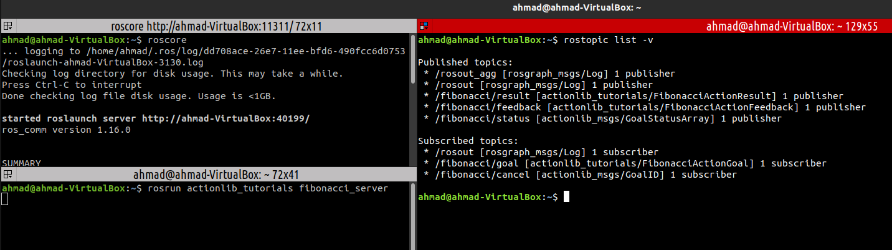

در ادامه نحوه ایجاد سرور به زبان پایتون را توضیح می دهیم و سپس به سراغ ایجاد کلاینت به زبان پایتون و سی پلاس پلاس می رویم. اکنون با کمک کامندهای زیر پوشه اسکریپ و فایل پایتونی سرور را ایجاد می کنیم و به آن قابلیت اجرایی شدن می دهیم:

```bash
$ mkdir scripts && touch scripts/fibonacci_server.py
$ cd scripts/
$ chmod +x fibonacci_server.py
```

درون فایل کد پایتون زیر را قرار می دهیم:

```py
#! /usr/bin/env python3

import rospy
import actionlib
import actionlib_tutorials.msg


class FibonacciAction(object):
    _feedback = actionlib_tutorials.msg.FibonacciFeedback() # Feed-Back Message
    _result = actionlib_tutorials.msg.FibonacciResult() # Result Message
    def __init__(self, name): # Costructor Fcn.
        # Name, Create and Start server
        self._action_name = name
        self._as = actionlib.SimpleActionServer(self._action_name, actionlib_tutorials.msg.FibonacciAction, execute_cb=self.execute_cb, auto_start = False)
        self._as.start()

    # Define Call-Back Fcn.
    def execute_cb(self, goal):
        r = rospy.Rate(1) # 1 Hz
        success = True
        self._feedback.sequence = []
        self._feedback.sequence.append(0) # append() add an item to end of "sequence" list
        self._feedback.sequence.append(1)

        # Calculting The Fib. Series
        for i in range(1, goal.order):
            if self._as.is_preempt_requested():
                rospy.loginfo('%s: Preempted' % self._action_name)
                self._as.set_preempted()
                success = False
                break
            self._feedback.sequence.append(self._feedback.sequence[i] + self._feedback.sequence[i-1])
            self._as.publish_feedback(self._feedback)
            r.sleep()
        if success:
            self._result.sequence = self._feedback.sequence
            rospy.loginfo('%s: Succeeded' % self._action_name)
            self._as.set_succeeded(self._result)


# Running Server
if __name__ == '__main__':
    rospy.init_node('fibonacci')
    server = FibonacciAction(rospy.get_name())
    rospy.spin()
```

خروجی مشابه برنامه سی پلاس پلاس خواهد بود. حال به سراغ ایجاد برنامه کلاینت با کمک سی پلاس پلاس می رویم. در داخل پوشه src یک فایل با نام fibonacci_client.cpp ایجاد می کنیم و کد زیر را در داخل آن قرار می دهیم:

```c++
#include <ros/ros.h>
#include <actionlib/client/simple_action_client.h>
#include <actionlib_tutorials/FibonacciAction.h>


using namespace actionlib_tutorials;
typedef actionlib::SimpleActionClient<FibonacciAction> Client; // Make Client


// Done Call-Back Fcn.
void doneCb(const actionlib::SimpleClientGoalState& state,const FibonacciResultConstPtr& result)
{
  ROS_INFO("Finished in state [%s]", state.toString().c_str());
  ROS_INFO("Answer: %i", result->sequence.back());
  ros::shutdown();
}


// Active Call-Back Fcn.
void activeCb()
{
  ROS_INFO("Goal just went active");
}


// Feed-Back Call-Back Fcn.
void feedbackCb(const FibonacciFeedbackConstPtr& feedback)
{
  ROS_INFO("Got Feedback of length %lu", feedback->sequence.size());
}


// Main Fcn.
int main (int argc, char **argv)
{
  ros::init(argc, argv, "test_fibonacci_callback");


  Client ac("fibonacci", true); // Connect Client To "fibonacci" Action


  ROS_INFO("Waiting for action server to start.");
  ac.waitForServer(); // Wait for Connecting to Action Server
  ROS_INFO("Action server started, sending goal.");


  FibonacciGoal goal; // Define Goal
  goal.order = 20;


  // Passing Call Back Fcn. for "Done", "Active or Start", "Feedback" status
  ac.sendGoal(goal, &doneCb, &activeCb, &feedbackCb);


  // Define 30s limit for doing the loop
  bool finished_before_timeout = ac.waitForResult(ros::Duration(30.0));
  ros::spin();
  return 0;
}
```

در فایل CMakeList.txt کد زیر را قرار می دهیم:

```c
add_executable(fibonacci_client src/fibonacci_client.cpp)

target_link_libraries(
  fibonacci_client
  ${catkin_LIBRARIES}
)
```

حال در شاخه اصلی از فایل یک دور کامپایل می گیریم و سپس با کمک دستور زیر کلاینت و سرور را اجرا می کنیم:

```bash
$ roscore
$ rosrun actionlib_tutorials fibonacci_server
$ rosrun actionlib_tutorials fibonacci_client
```

توجه شود که در خروجی کلاینت تا 20 امین عدد فیبوناچی را برای ما حساب می کند. خروجی:

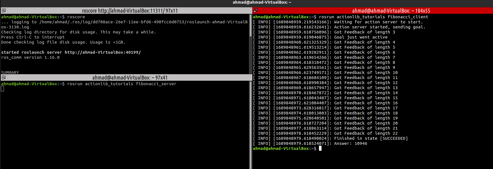

در ادامه این کلاینت را با کمک زبان پایتون ایجاد میکنیم. در پوشه scripts یک فایل با نام fibonacci_client.py ایجاد می کنیم و کد زیر را در داخل آن قرار می دهیم:

```py
#! /usr/bin/env python3
import rospy
import actionlib
import actionlib_tutorials.msg


# Define Active Call-Back (Start Fcn.)
def active_cb():
    print('active')


# Define Feed-Back Call-Back
def feedback_cb(feedback):
    print(len(feedback.sequence))


# Define Done Call-Back
def done_cb(status, result):
    print(status)
    print(result)


# Main Fcn.
if __name__ == '__main__':
       rospy.init_node('fibonacci_client_py') # init node


       # Add Client
       client = actionlib.SimpleActionClient('fibonacci', actionlib_tutorials.msg.FibonacciAction)
       client.wait_for_server() # Wait For Client


       # Define Goal
       goal = actionlib_tutorials.msg.FibonacciGoal(order=20)


       # Passing Call Back Fcn. for "Done", "Active or Start", "Feedback" status
       client.send_goal(goal,done_cb,active_cb,feedback_cb)
       client.wait_for_result()
       #client.get_result()
       #client.cancel_goal() # Stop Server
```

برای اجرا نیز به شرح زیر عمل می کنیم:

```bash
$ roscore
$ rosrun actionlib_tutorials fibonacci_server.py
$ rosrun actionlib_tutorials fibonacci_client.py
```

خروجی مشابه برنامه سی پلاس پلاس خواهد بود. توجه شود که در اکشن ها با کمک اعداد وضعیت نمایش داده می شود که در لیست زیر می توانید آنرا مشاهده نمایید:

- 0 : Pending : سرور در حالت آماده به کار است
- 1 : Active : پیام Goal دریافت شده و سرور در حالت انجام فرآیند است.
- 2 : Preempted : پس از شروع فرآیند، عملیات کنسل شده است.
- 3 : Succeeded : فرآیند با موفقیت به پایان رسیده است.
- 4 : Aborted : پیام goal در حین فرآیند توسط سرور رد شده است.
- 5 : Rejected : پیام goal قبل از اجرای فرآیند توسط سرور رد شده است.
- 6 : Preempting : پیام goal توسط سرور دریافت شده ولی فرآیند در حال کنسل کردن کار است.
- 7 : Recalling : سرور قبل از شروع فرآیند پیام کنسل را دریافت کرده ولی را شروع یا کنسل نکرده است.
- 8 : Recalled : سرور قبل از شروع فرآیند پیام کنسل را دریافت کرده و فرآیند درست کنسل شده است.
- 9 : Lost : پیام goal از بین رفته است.

## تنظیم مجدد پارامترها با کمک Dynamic Reconfigure

سیستم عامل ROS در واقع استفاده از کتابخانه و پکیج های مختلف و تنظیم پارامترهای مربوط به آنها می باشد. برای تنظیم این پارامترها، خود راس یک ابزار مناسب دارد به نام dynamic Reconfigure که امکان تعیین پارامتر های راس را به ما می دهد. برای تست این ابزار یک پکیج جدید ایجاد می کنیم (برای مثال dynamic_tuts):

```bash
$ cd catkin_ws/src
$ catkin_create_pkg dynamic_tuts rospy roscpp dynamic_reconfigure
```

سپس وارد این پکیج شده و یک پوشه برای کانفیگ ها به نام cfg می سازیم تا لیست کانفیگ های دینامیک را در دخل این فولدر قرار دهیم. برای مثال یک فایل tuts.cfg ایجاد می کینم:

```bash
$ mkdir cfg && cd cfg
$ touch tuts.cfg
```

در داخل فولدر tuts.cfg ایجاد می کنیم و کد زیر را در داخل آن قرار می دهیم (توجه شود که از همان زبان پایتون برای نگارش فایل های cfg استفاده می کنیم.

```py
#!/usr/bin/env python3
PACKAGE = "dynamic_tutorials"

# Import libs
from dynamic_reconfigure.parameter_generator_catkin import *

# Create Parameter Generator Obj
gen = ParameterGenerator()

# Define Parameters and add it to dyna-confg: name, type, level, description, default, *min, *max
gen.add("int_param",    int_t,    0,   "An Integer parameter", 50,  0,   100)
gen.add("double_param", double_t, 0,   "A double parameter",   .5,    0,   1)
gen.add("str_param",    str_t,    0,   "A string parameter",   "Hello World")
gen.add("bool_param",   bool_t,   0,   "A Boolean parameter",  True)

# Drop-List Parameter (enum)
size_enum = gen.enum([ gen.const("Small",      int_t, 0, "A small constant"),
                       gen.const("Medium",     int_t, 1, "A medium constant"),
                       gen.const("Large",      int_t,  2, "A large constant"),
                       gen.const("ExtraLarge", int_t,  3, "An extra large constant")],
                     "An enum to set size")

# Add enum to dyna-confg
gen.add("size", int_t, 0, "A size parameter which is edited via an enum",
                     1, 0, 3, edit_method=size_enum)

# End
exit(gen.generate(PACKAGE, "dynamic_tutorials", "Tutorials"))
```

حتما با کمک کد زیر به فایل اجازه اجاره شدن بدهید:

```bash
$ chmod +x cfg/tuts.cfg
```

در فایل CMakeList.txt نیز در بخش مربوط به کانفیگ ها دستور زیر را از حالت کامنت در بیاورید و آدرس فایل کانفیگ ایجاد شده را بدهید:

```
## Generate dynamic reconfigure parameters in the 'cfg' folder
generate_dynamic_reconfigure_options(
  cfg/tuts.cfg
#   cfg/DynReconf2.cfg
 )
```

سپس به شاخه اصلی رفته catkin_make بگیرید. در ادامه یک فایل پایتونی ایجاد میکنیم که از این پارامترها ایجاد شده در بخش قبلی بتوانیم در داخل یک نود استفاده کنیم. یک پوشه scripts ایجاد کرده و در داخل آن یک فایل پایتونی با نام server.py در داخل آن ایجاد می کنیم و کد زیر را در داخل آن قرار می دهیم:

```py
#!/usr/bin/env python3
import rospy
from dynamic_reconfigure.server import Server
from dynamic_tuts.cfg import tutsConfig

# Call Back Fcn.
def callback(config, level):
    rospy.loginfo("""Reconfigure Request: {int_param}, {double_param},\
          {str_param}, {bool_param}, {size}""".format(**config))
    return config

# Main Part
if __name__ == "__main__":
    rospy.init_node("dynamic_tutorials", anonymous = False)


    srv = Server(tutsConfig, callback)
    rospy.spin()
```

لازم است حتما به این برنامه قابلیت اجرایی بدهیم. توجه شود که از طریق متغیر level برنامه ریکانفیگر متوجه تغییرات در پارامتر ها می شود. حال هسته راس، این برنامه سرور و برنامه rqt_reconfigure را اجرا می کنیم و تغییر پارامترها را تست می کنیم:

```bash
$ roscore
$ rosrun dynamic_tuts server.py
$ rosrun rqt_reconfigure rqt_reconfigure
```

خروجی به شکل زیر خواهد بود:

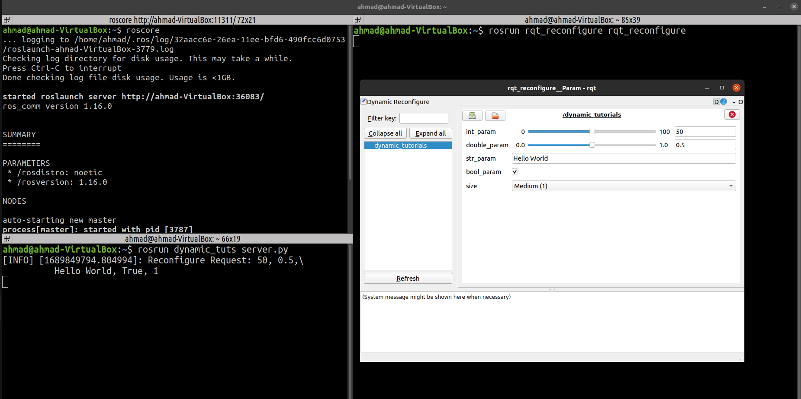

توجه شود که می توان چندین فایل کانفیگ ایجاد کرد و پارامتر آنها را از طریق rqt_reconfigure کنترل کرد. با هر بار تغییر دادن یک مقدار در rqt سرور لاگ ایجاد می کند (توجه شود حتما سرور باید اجرا شود که کانفیگ ایجاد شده در rqt قرار بگیرد.)

حالا همین کد را در داخل سی پلاس پلاس اجرا می کنیم. در داخل پوشه src یک فایل به نام server.cpp ایجاد می کنیم و کد زیر را قرار می دهیم. (روند مشابه همان پایتون هست):

```c++
#include <ros/ros.h>
#include <dynamic_reconfigure/server.h>
#include <dynamic_tuts/tutsConfig.h>


void callback(dynamic_tuts::tutsConfig &config, uint32_t level) {
  ROS_INFO("Reconfigure Request: %d %f %s %s %d",
            config.int_param, config.double_param, config.str_param.c_str(),
            config.bool_param?"True":"False", config.size);
}


int main(int argc, char **argv) {
  ros::init(argc, argv, "dynamic_tuts");
  dynamic_reconfigure::Server<dynamic_tuts::tutsConfig> server;
  dynamic_reconfigure::Server<dynamic_tuts::tutsConfig>::CallbackType f;
  f = boost::bind(&callback, _1, _2);
  server.setCallback(f);
  ROS_INFO("Spinning node");
  ros::spin();
  return 0;
}
```

خروجی مشابه پایتون خواهد بود. تا به اینجای کار تمام برنامه هایی که ایجاد کرده ایم سرور بودند و به امکان ایجاد تغییرات می دادند ولی در صورتی که بخواهیم تغییرات را مشاهده نماییم نیاز به ایجاد یک برنامه کلاینت است که آنرا با کمک پایتون ایجاد می کنیم. یک فایل پایتونی در پوشه script با نام client.py ایجاد کرده و قابلیت اجرایی به آن می دهیم. درون این فایل کد زیر را قرار می دهیم:

```py
#!/usr/bin/env python3
import rospy
import dynamic_reconfigure.client


def callback(config):
    rospy.loginfo("Config set to {int_param}, {double_param}, {str_param}, {bool_param}, {size}".format(**config))


if __name__ == "__main__":
    rospy.init_node("dynamic_client")
    client = dynamic_reconfigure.client.Client("dynamic_tutorials", timeout=30, config_callback=callback)


    r = rospy.Rate(1)


    x = 0
    b = False


    while not rospy.is_shutdown():
        x = x+1
        if x>10:
            x=0
        b = not b
        client.update_configuration({"int_param":x, "double_param":(float(1)/(x+1)), "str_param":str(rospy.get_rostime()), "bool_param":b, "size":1})
        r.sleep()
```

در ادامه هسته راس، سرور و کلاینت را راه اندازی می کنیم. همچنی برنامه rqt_reconfigure را نیز اجرا می کنیم. مشاهده می شود که پارامترها تغییر می کنند.

## آشنایی با محیط rviz و اجرای چند مثال

نرم افزار rviz یک نرم افزار برای نمایش گذاشتن داده های مختلف می باشد. برخی این نرم افزار را با یک نرم افزار شبیه ساز جابجا می گیرند در حالیکه وظیفه rviz تنها بصری کردن داده ها می باشد و مناسب شبیه سازی مدل های رباتیکی نمی باشد. توجه شود که واحدهای استاندارد در داخل rviz همان واحد های استاندارد ros می باشد. برای اجرا کردن rviz کافی است کد زیر را در داخل ترمینال اجرا کنید:

```bash
$ roscore
$ rviz
```

نرم افزار rviz برایتان باز خواهد شد. این نرم افزار از بخش های مختلفی تشکیل شده است که می توان به مهمترین آن یعنی بهش display اشاره کرد. همچنین از طریق منوی panel می توانید بخش های مختلف rviz را آشکار/پنهان کنید.

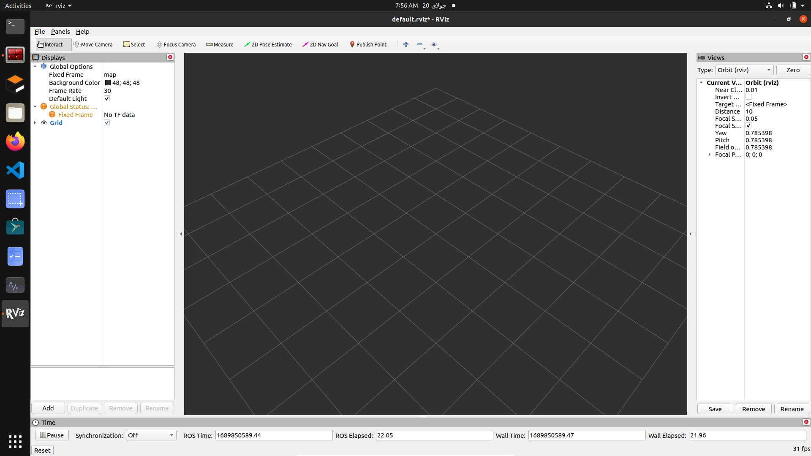

برای اضافه کردن یک دیتا یا نمایشگر خاص با کمک گزینه Add در پنل Display می توانید عمل افزودن را انجام دهید. به دو روش می توانید آیتم ها بصری را اضافه نمایید. یکی با کمک نوع آیتم (By display type) و یکی هم با کمک تاپیک ها (By topic) که در شکل زیر می توانید مشاهده نمایید:

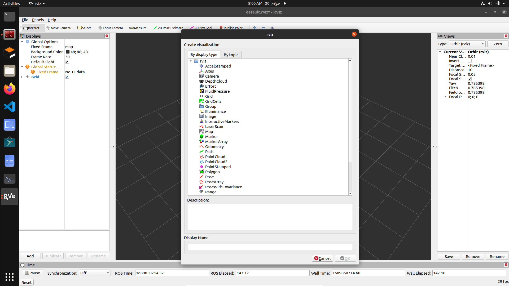

با کمی سعی و خطا می توانید با سایر آپشن های این محیط آشنا شوید (که البته از اهمیت کمتری برخوردار هستن). در ادامه می خواهیم یک برنامه ایجاد کنیم یک تعداد داده گرافیکی ایجاد کند و ما آن داده ها گرافیکی را در rviz مشاهده کنیم. به پوشه catkin_ws/src می رویم و یک پکیج جدید به نام using_markers ایجاد می کنیم که در آن از rocpp و visualization_msgs استفاده شده است. در ادامه به داخل پوشه src پکیج ایجاد شده می رویم و یک فایل جدید به نام basic_shapes.cpp ایجاد می کنیم:

```bash
$ catkin_create_pkg using_markers roscpp visualization_msgs rospy
$ touch basic_shapes.cpp
```

در داخل این فایل برنامه زیر را قرار می دهیم:

```c++
#include <ros/ros.h>
#include <visualization_msgs/Marker.h>


int main( int argc, char** argv )
{
  ros::init(argc, argv, "basic_shapes"); // make a node
  ros::NodeHandle n;
  ros::Rate r(1); // 1 Hz Freq.


  // Create a topic with the name of "visualization_marker" contains the marker datas
  ros::Publisher marker_pub = n.advertise<visualization_msgs::Marker>("visualization_marker", 1);


  // Create a cube marker
  uint32_t shape = visualization_msgs::Marker::CUBE;


  // Main Loop
  while (ros::ok())
  {
    visualization_msgs::Marker marker;
    marker.header.frame_id = "/my_frame"; // Pose Origin
    marker.header.stamp = ros::Time::now(); // Time Origin


    marker.ns = "basic_shapes"; // Name
    marker.id = 0; // id
    marker.type = shape;
    marker.action = visualization_msgs::Marker::ADD; // Action Add to visualization_msgs::Marker


    // Position of cube
    marker.pose.position.x = 0;
    marker.pose.position.y = 0;
    marker.pose.position.z = 0;
    marker.pose.orientation.x = 0.0;
    marker.pose.orientation.y = 0.0;
    marker.pose.orientation.z = 0.0;
    marker.pose.orientation.w = 1.0;


    // Marker Scale
    marker.scale.x = 1.0;
    marker.scale.y = 1.0;
    marker.scale.z = 1.0;


    // Marker Color
    marker.color.r = 0.0f; // red = 0
    marker.color.g = 1.0f; // green = 1
    marker.color.b = 0.0f; // blue = 0
    marker.color.a = 1.0; // opacity = 1
    marker.lifetime = ros::Duration();


    // Wait for a subscriber (rviz)
    while (marker_pub.getNumSubscribers() < 1)
    {
      if (!ros::ok())
      {
        return 0;
      }
      ROS_WARN_ONCE("Please create a subscriber to the marker");
      sleep(1);
    }


    // Publish marker data
    marker_pub.publish(marker);


    // Shape Loop
    switch (shape)
    {
    case visualization_msgs::Marker::CUBE:
      shape = visualization_msgs::Marker::SPHERE;
      break;
    case visualization_msgs::Marker::SPHERE:
      shape = visualization_msgs::Marker::ARROW;
      break;
    case visualization_msgs::Marker::ARROW:
      shape = visualization_msgs::Marker::CYLINDER;
      break;
    case visualization_msgs::Marker::CYLINDER:
      shape = visualization_msgs::Marker::CUBE;
      break;
    }
    r.sleep();
  }
}

```

در برنامه بالا با استفاده از مارکرها اشکالی را در محیط rviz به نمایش گذاشتیم. توجه شود که حتما fixed frame را بر روی iframe قرار دهید. توجه شود که کد زیر را در داخل فایل CMakeList.txt قرار دهید:

```
add_executable(basic_shapes src/basic_shapes.cpp)
target_link_libraries(basic_shapes ${catkin_LIBRARIES})
```

با اجرای هسته راس و همچنین برنامه بالا و برنامه rviz خروجی را مشاهده می کنیم:

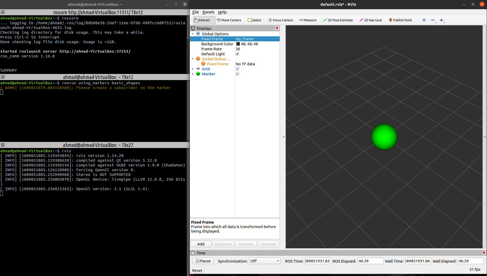

در ادامه در مورد point ، line-stream و line-list صحبت میکنیم. همانگونه که مشخص است point ها نقاط مشخصی از فضا هستند که با x,y,z مشخص می شوند. line-stream هم یک خط است که از میان چند نقطه عبور می کند. line-list هم به مجموعه از خط ها می گویند که نقاط مختلف را به هم متصل می کنند. در ادامه یک فایل با نام point_and_lines.cpp ایجاد می کنیم و برنامه زیر را در داخل آن قرار می دهیم (یکی دیگر از مثال های سایت خود راس):

```c++
#include <ros/ros.h>
#include <visualization_msgs/Marker.h>
#include <cmath>


int main( int argc, char** argv )
{
  ros::init(argc, argv, "points_and_lines"); // Make A Node
  ros::NodeHandle n;


  // Create A Publisher Topic
  ros::Publisher marker_pub = n.advertise<visualization_msgs::Marker>("visualization_marker", 10);
  ros::Rate r(30); // 30Hz
  float f = 0.0;
  while (ros::ok())
  {
    // Create points, line_strip, line_list
    visualization_msgs::Marker points, line_strip, line_list;
    points.header.frame_id = line_strip.header.frame_id = line_list.header.frame_id = "my_frame";
    points.header.stamp = line_strip.header.stamp = line_list.header.stamp = ros::Time::now();
    points.ns = line_strip.ns = line_list.ns = "points_and_lines";
    points.action = line_strip.action = line_list.action =  visualization_msgs::Marker::ADD;


    // Make it non-rotate
    points.pose.orientation.w = line_strip.pose.orientation.w =  line_list.pose.orientation.w = 1.0;


    // Id
    points.id = 0;
    line_strip.id = 1;
    line_list.id = 2;


    // Define Type
    points.type = visualization_msgs::Marker::POINTS;
    line_strip.type = visualization_msgs::Marker::LINE_STRIP;
    line_list.type = visualization_msgs::Marker::LINE_LIST;


    // Scale
    points.scale.x = 0.2;
    points.scale.y = 0.2;


    line_strip.scale.x = 0.1;
    line_list.scale.x = 0.1;


    // Color
    points.color.g = 1.0f;
    points.color.a = 1.0;


    line_strip.color.b = 1.0;
    line_strip.color.a = 1.0;


    line_list.color.r = 1.0;
    line_list.color.a = 1.0;


    // Make sinudsial wave
    for (uint32_t i = 0; i < 100; ++i)
    {
      float y = 5 * sin(f + i / 100.0f * 2 * M_PI);
      float z = 5 * cos(f + i / 100.0f * 2 * M_PI);


      geometry_msgs::Point p;
      p.x = (int32_t)i - 50;
      p.y = y;
      p.z = z;


      points.points.push_back(p); // Append
      line_strip.points.push_back(p);


      line_list.points.push_back(p);
      p.z += 1.0;
      line_list.points.push_back(p);
    }


    // Publish data
    marker_pub.publish(points);
    marker_pub.publish(line_strip);
    marker_pub.publish(line_list);


    r.sleep();


    f += 0.04; // Offset
  }
}
```

در فایل CMakeList.txt هم کد زیر را اضافه می کنیم:

```
add_executable(point_and_lines src/point_and_lines.cpp)
target_link_libraries(point_and_lines ${catkin_LIBRARIES})
```

اکنون برنامه را اجرا میکنیم:

```bash
$ roscore
$ rosrun using_markers point_and_lines
$ rviz
```

خروجی به شکل زیر خواهد بود:

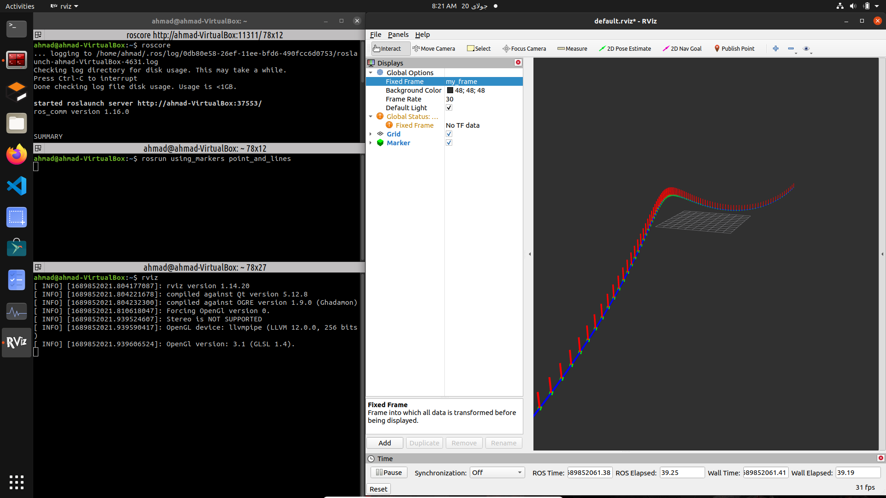

خروجی دسته پوینت و لاین استریم خواهد بود. توجه شود که اگر در راس ملودیک هستید حتما قبل از فریم ها از بک اسلش (/) استفاده نمایید.

نقاط سبز پوینت ها هستند، خطوط آبی لاین استریم هستند و خطوط قرمز لاین لیست هستند.

در صورتیکه بخواهیم از محیط Rviz اطلاعاتی برای محیط راس ارسال کنیم، نیاز است تا با interactive markers کار کنیم. این مارکرها از کنترلرهای مختلفی ایجاد شده اند. در ادامه یک سرور ایجاد می کنیم که حاوی یک interactive marker می باشد. یک برنامه سی پلاس پلاس با نام simple_interactive_marker.cpp ایجاد می کنیم و کد زیر را در داخل آن قرار می دهیم:

```c++
#include <ros/ros.h>
#include <interactive_markers/interactive_marker_server.h>


// This Fcn. will called when user make change about the marker in Rviz
void processFeedback(
    const visualization_msgs::InteractiveMarkerFeedbackConstPtr &feedback )
{
  ROS_INFO_STREAM( feedback->marker_name << " is now at "
      << feedback->pose.position.x << ", " << feedback->pose.position.y
      << ", " << feedback->pose.position.z );
}


// Main Fcn.
int main(int argc, char** argv)
{
  ros::init(argc, argv, "simple_marker"); // Initiate A Node


  // Create A Server Marker
  interactive_markers::InteractiveMarkerServer server("simple_marker");


  // Make An Interactive Marker
  visualization_msgs::InteractiveMarker int_marker;
  int_marker.header.frame_id = "base_link";
  int_marker.header.stamp=ros::Time::now();
  int_marker.name = "my_marker";
  int_marker.description = "Simple 1-DOF Control";


  visualization_msgs::Marker box_marker;
  box_marker.type = visualization_msgs::Marker::CUBE; // Cube
  box_marker.scale.x = 0.45;
  box_marker.scale.y = 0.45;
  box_marker.scale.z = 0.45;
  box_marker.color.r = 0.5;
  box_marker.color.g = 0.5;
  box_marker.color.b = 0.5;
  box_marker.color.a = 1.0;


  // Create A Control
  visualization_msgs::InteractiveMarkerControl box_control;
  box_control.always_visible = true;
  box_control.markers.push_back( box_marker );


  int_marker.controls.push_back( box_control );
  visualization_msgs::InteractiveMarkerControl rotate_control;
  rotate_control.name = "move_x";
  rotate_control.interaction_mode = visualization_msgs::InteractiveMarkerControl::MOVE_AXIS; // Constrain


  int_marker.controls.push_back(rotate_control);
  server.insert(int_marker, &processFeedback);
  server.applyChanges();
  ros::spin();
}
```

در فایل CMakeList.txt نیز کد زیر را قرار می دهیم:

```
add_executable(simple_interactive_marker src/simple_interactive_marker.cpp)
target_link_libraries(simple_interactive_marker ${catkin_LIBRARIES})
```

حتما در لیست depencyها interactive_markers را قرار دهید:

```
find_package(catkin REQUIRED COMPONENTS
  roscpp
  rospy
  visualization_msgs
  interactive_markers
)
```

در ادامه برنامه را اجرا می کنیم:

```bash
$ roscore
$ rosrun using_markers simple_interactive_marker
$ rviz
```

خروجی به شکل زیر خواهد بود:

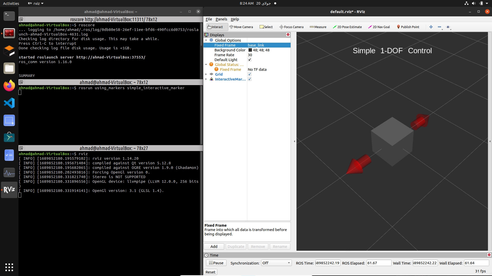

در برنامه rviz حتما فیکس فریم را بر روی base_link قرار دهید. مشاهده می شود که با جابجا کردن مارکر، تغییران آن در ترمینال مربوط به سرور چاپ می شود. همین مارکر می خواهیم با پایتون ایجاد کنیم. در پوشه اصلی پکیج یک دایرکتوری با نام scripts ایجاد می کنیم و در داخل آن یک فایل پایتون با نام simple_interactive_marker.py ایجاد کرده و به آن قابلیت اجرایی می دهیم. داخل فایل پایتون کد زیر را قرار می دهیم:

```py
#!/usr/bin/env python3
import rospy
from interactive_markers.interactive_marker_server import *
from visualization_msgs.msg import *


# This Fcn. will called when user make change about the marker in Rviz
def processFeedback(feedback):
    p = feedback.pose.position
    print(feedback.marker_name+" is now at "+str(p.x)+", "+str(p.y)+", "+str(p.z))


# Main
if __name__=="__main__":
    rospy.init_node("simple_marker") # Initiate Node
    server = InteractiveMarkerServer("simple_marker") # Creater A Marker Server

    # Make Marker
    int_marker = InteractiveMarker()
    int_marker.header.frame_id = "base_link"
    int_marker.name = "my_marker"
    int_marker.description = "Simple 1-DOF Control"


    box_marker = Marker()
    box_marker.type = Marker.CUBE
    box_marker.scale.x = 0.45
    box_marker.scale.y = 0.45
    box_marker.scale.z = 0.45
    box_marker.color.r = 0.0
    box_marker.color.g = 0.5
    box_marker.color.b = 0.5
    box_marker.color.a = 1.0


    box_control = InteractiveMarkerControl()
    box_control.always_visible = True
    box_control.markers.append( box_marker )


    int_marker.controls.append( box_control )


    rotate_control = InteractiveMarkerControl()
    rotate_control.name = "move_x"
    rotate_control.interaction_mode = InteractiveMarkerControl.MOVE_AXIS
    int_marker.controls.append(rotate_control);
    server.insert(int_marker, processFeedback)
    server.applyChanges()
    rospy.spin()
```

خروجی این برنامه مشابه نسخه سی پلاس پلاس آن خواهد بود. (توجه شود که rospy باید به جمع پیش نیاز ها اضافه شود.)
تا به اینجای کار ما مارکرهایی با درجه آزادی محدود ایجاد کردیم در حالیکه دست ما برای ایجاد مارکرها بسیار باز است. با کمک کامند زیر می توانیم لیست برخی از این درجه های آزاد مختلف را مشاهده نماییم:

```bash
$ roscore
$ rosrun interactive_marker_tutorials basic_controls
$ rviz
```

در بخش فیکس فریم، بر روی base_link تنظیم شود (دو فریم دیگر مربوط به مکعب چرخنده و متحرک می باشد) برای دسترسی به فایل پایتون این برنامه کافی است به آدرس زیر بروید:

```
/opt/ros/noetic/lib/interactive_marker_tutorials/basic_controls.py
```

که می توانید هر کدام از مارکر ها را خودتان تفسیر کنید. نسخه سی پلاس پلاس هم در فایل ضمیمه قرار گرفته است که می توانید مشاهده و تحلیل کنید (اگر نیاز به این مارکرها شد بیا مطالعه کن)

صورت مشکل: نکته عجیب در مورد این برنامه که در ros نسخه ملودیک کار داد ولی در نسخه نئوتیک کار نداد!

حل مشکل: در نسخه نئوتیک در بخش frame_id از / استفاده نکنیم مشکل حل می شود:

```py
marker.header.frame_id = "my_frame"; // Pose Origin
```

برای مشاهده قدرت این مارکرها برنامه زیر را اجرا کنید:

```bash
$ roscore
$ rosrun interactive_marker_tutorials pong
$ rviz
```

متغیر fixed_frame بر روی base_link تنظیم شود. خروجی به شکل زیر خواهد بود:

البته همانگونه که پیش تر هم ذکر شد ما برای شبیه سازی از ابزار حرفه ای تری به نام Gazebo بهره خواهیم برد و از پکیج rviz صرفا برای شبیه سازی داده ها استفاده خواهیم کرد.
